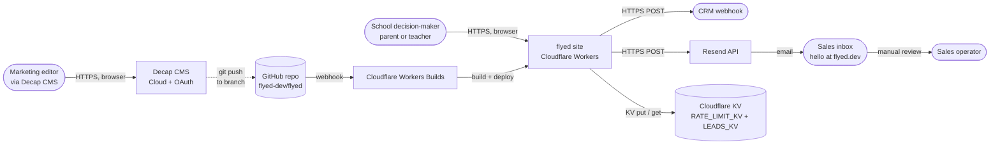
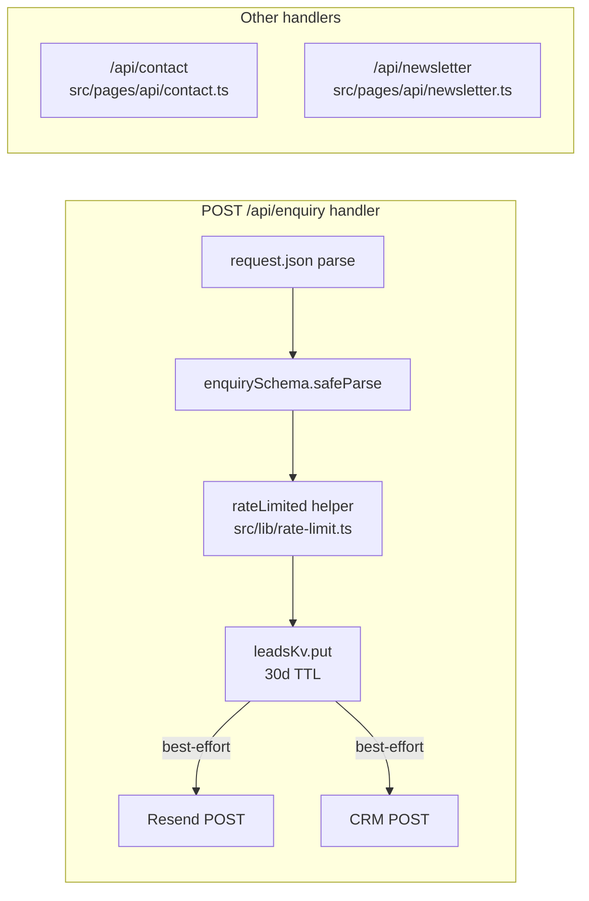
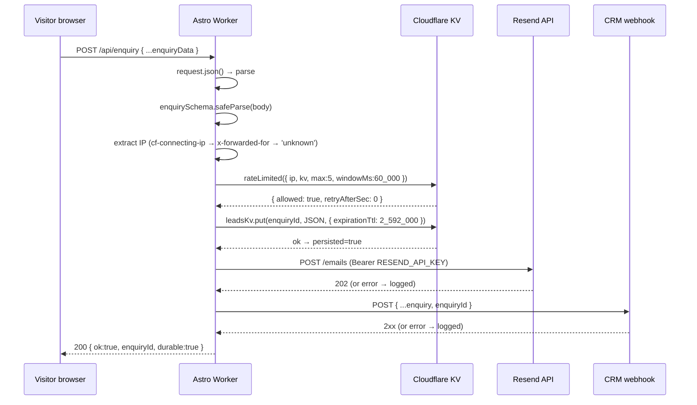
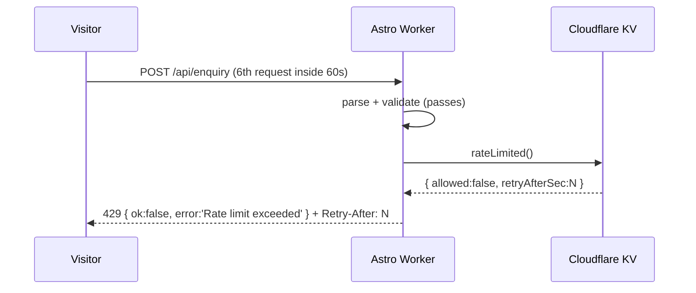
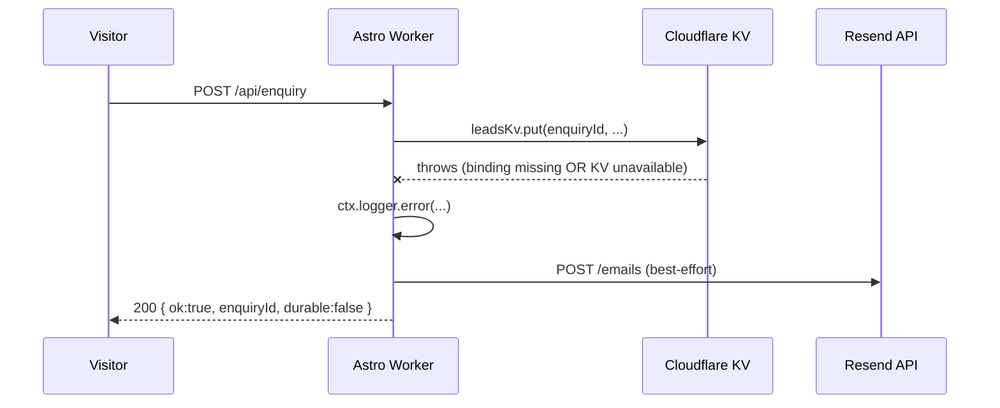
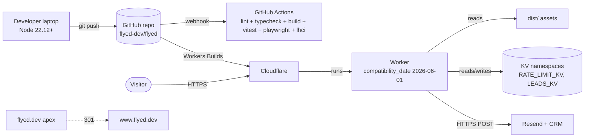

# Architecture overview — flyed

This document describes the **as-built** architecture of the flyed marketing site
at branch tip `6830fe4` (Wave 7). The marketing surface (information architecture,
design tokens, copy) is described in
`docs/superpowers/specs/2026-06-30-flyed-marketing-site-design.md`; this document
covers the runtime, not the marketing content. Where the two disagree, the code
wins and a note is left here.

## 1. Introduction and goals

### 1.1 Requirements overview

flyed is a bilingual (EN + TH) marketing site for inbound educational travel to
Thailand. The site has three jobs: explain who flyed is and what trips it sells,
capture qualified leads via an enquiry form, and provide a content surface (blog,
destinations, itineraries, team) that ranks in search and reassures school
decision-makers. The site is pre-rendered at build time so the marketing surface
serves as static HTML; only the three runtime endpoints under `/api/*` and the
Decap CMS admin under `/admin/*` execute on the edge.

### 1.2 Quality goals

| #   | Quality (ISO 25010)    | Concrete scenario                                                                                                                                                                                                | Priority |
| --- | ---------------------- | ---------------------------------------------------------------------------------------------------------------------------------------------------------------------------------------------------------------- | -------- |
| Q1  | Performance efficiency | Home page LCP < 2.5s on a mid-tier mobile device; Lighthouse `performance` ≥ 0.95 (CI gate per `.lighthouserc.json:19`).                                                                                         | High     |
| Q2  | Maintainability        | A new engineer can answer "what does `POST /api/enquiry` accept?" in under 2 minutes by reading this document and `docs/api/overview.md`.                                                                        | High     |
| Q3  | Reliability            | A Resend or CRM outage cannot lose a lead — `LEADS_KV` write happens **before** downstream dispatch (see `src/pages/api/enquiry.ts:62-67`).                                                                      | High     |
| Q4  | Internationalization   | EN and TH live in one collection per content type; URLs differ by `/th` prefix only; page pairings carry `hreflang` alternates (`src/layouts/Layout.astro:78-99`).                                               | Medium   |
| Q5  | Security & privacy     | Server-side validation of every payload (`src/pages/api/*.ts`); no logging of form data in `/api/contact` (`src/pages/api/contact.ts:18`); rate-limit before any side effect (`src/pages/api/enquiry.ts:34-48`). | Medium   |

### 1.3 Stakeholders

| Role                                             | Expectation of the architecture                                                                                                                   |
| ------------------------------------------------ | ------------------------------------------------------------------------------------------------------------------------------------------------- |
| Marketing team                                   | Add/edit blog posts and itinerary metadata via Decap CMS at `/admin`.                                                                             |
| Sales team                                       | Receive enquiry emails via Resend; lead records durable in `LEADS_KV` for 30 days.                                                                |
| Engineering                                      | One developer. Branch is `wave-7-improvements`; CI runs lint + typecheck + build + Vitest + Playwright + Lighthouse (`.github/workflows/ci.yml`). |
| Site visitor (parent / teacher / head of school) | Fast page loads on mobile, accessible forms, accurate Thai translations.                                                                          |

## 2. Constraints

| Constraint                                         | Background                                                                                                                                                                                                  | Consequence for the design                                                                                                                                                     |
| -------------------------------------------------- | ----------------------------------------------------------------------------------------------------------------------------------------------------------------------------------------------------------- | ------------------------------------------------------------------------------------------------------------------------------------------------------------------------------ |
| Cloudflare Workers runtime                         | Project migrated from Pages to Workers in Wave 7 (`docs/superpowers/specs/2026-07-04-cloudflare-workers-migration-design.md`; `wrangler.jsonc`).                                                            | All runtime code must be Workers-compatible; the `@astrojs/cloudflare` adapter's `imageService` is `passthrough` because Sharp isn't available (see `astro.config.mjs:46-48`). |
| `compatibility_date: 2026-06-01` + `nodejs_compat` | Set in `wrangler.jsonc:3-4`.                                                                                                                                                                                | Polyfills available; full Node API surface usable in handlers.                                                                                                                 |
| Node ≥ 22.12.0                                     | Required engine per `package.json:6`.                                                                                                                                                                       | Local dev and CI both pinned to Node 22 (`package.json:6`, `.github/workflows/ci.yml:18`).                                                                                     |
| Astro 7 (`output: 'static'`)                       | Marketing surface pre-rendered; only `/api/*` opt into SSR via `export const prerender = false` per-file (see `src/pages/api/enquiry.ts:6`, `src/pages/api/contact.ts:4`, `src/pages/api/newsletter.ts:4`). | Image processing at build time only; runtime endpoints are thin.                                                                                                               |
| Zod 3 (not 5)                                      | `package.json:41` pins `zod@^3.25.76`; Zod 5 flagged as "Known post-launch item" in `DEPLOY.md`.                                                                                                            | Validation uses Zod 3 syntax (e.g. `z.string().email()` rather than `z.email()`).                                                                                              |
| One developer                                      | Per `DEPLOY.md` preamble and the audit report.                                                                                                                                                              | No multi-tenant auth, no RBAC, no on-call rotation. Manual rollback via `wrangler deployments rollback` (`DEPLOY.md` "Rollback").                                              |
| No Astro DB                                        | Original spec (`docs/superpowers/specs/2026-06-30-flyed-marketing-site-design.md`) mentioned Astro DB; code uses `LEADS_KV` (KV) instead, per the audit's Finding E.1.                                      | Leads are not queryable; only retrievable by `enquiryId` from `LEADS_KV` with a 30-day TTL (`src/pages/api/enquiry.ts:67`).                                                    |

## 3. Context and scope

### 3.1 Business context



_Caption: visitor and editor are the two user roles; sales is an indirect consumer of the lead-capture path; deployment is git-driven via Cloudflare Workers Builds._

### 3.2 Technical context

- **Transport.** All visitor traffic is HTTPS terminated by Cloudflare. The site
  is reachable at `https://flyed.dev` (apex) and `https://www.flyed.dev` (which
  redirects to apex via a Cloudflare Redirect Rule; static `_redirects` cannot
  express absolute URLs — see `DEPLOY.md` §4 and the audit B.2).
- **Assets.** Pre-rendered HTML, JS, CSS, and static images live under `dist/`
  and are served via the Workers ASSETS binding (`wrangler.jsonc:7-9`). Per-route
  SSR (`/api/*`, `/admin/*`) executes in the Worker entrypoint
  `@astrojs/cloudflare/entrypoints/server` (`wrangler.jsonc:5`).
- **Secrets.** `RESEND_API_KEY` and `CRM_WEBHOOK_URL` are server-only secrets
  declared in `astro.config.mjs:51-52` and `src/env.d.ts:7-8`. They must be set
  via `wrangler secret put` (`DEPLOY.md` §2). `ENQUIRY_TO_EMAIL` is a public
  server var with a default of `sales@flyed.dev` (`astro.config.mjs:53-58`).

## 4. Solution strategy

| Strategy                                                                     | Driver                                                                | Evidence                                                                                                                                                | ADR                                                                          |
| ---------------------------------------------------------------------------- | --------------------------------------------------------------------- | ------------------------------------------------------------------------------------------------------------------------------------------------------- | ---------------------------------------------------------------------------- |
| Static-first Astro with opt-in SSR for `/api/*` and `/admin/*`               | Q1 (performance) — pre-rendered HTML is the fastest possible delivery | `astro.config.mjs:42`, `src/pages/api/enquiry.ts:6`                                                                                                     | [ADR-0003](./decisions/0003-astro-7-static-default-with-opt-in-ssr.md)       |
| Run on Cloudflare Workers (not Pages) for native KV bindings + observability | Q3 (reliability) — `LEADS_KV` and `RATE_LIMIT_KV` are edge-resident   | `wrangler.jsonc:1-32`, `astro.config.mjs:43-48`                                                                                                         | [ADR-0001](./decisions/0001-cloudflare-workers-vs-pages.md)                  |
| React 19 islands (not SPA) for interactive bits                              | Q1 + Q2 — ships JS only where needed; preserves view transitions      | `src/components/EnquiryForm.tsx`, `client:visible` / `client:idle` directives (`src/components/EnquirePage.astro:37`, `src/components/Header.astro:59`) | [ADR-0005](./decisions/0005-react-19-islands-with-astro-view-transitions.md) |
| Durable lead capture to `LEADS_KV` before any side effect                    | Q3 — a Resend outage cannot lose a lead                               | `src/pages/api/enquiry.ts:62-76`                                                                                                                        | [ADR-0002](./decisions/0002-kv-namespaces-and-durability.md)                 |
| Defer real AVIF/WebP until images are ESM-imported from `src/assets/`        | Q1 — passthrough image service is the only thing that runs today      | `astro.config.mjs:77-84`, `src/components/HomePage.astro:17`                                                                                            | [ADR-0004](./decisions/0004-avif-webp-deferred.md)                           |

## 5. Building block view

### 5.1 Level 1 — whitebox of the overall system

```mermaid
flowchart LR
  subgraph site[flyed site — Cloudflare Worker]
    pages[Static pages<br/>src/pages/*.astro<br/>prerender=true]
    api[SSR endpoints<br/>src/pages/api/*.ts<br/>prerender=false]
    layouts[Layouts + components<br/>src/layouts/, src/components/]
    islands[React 19 islands<br/>src/components/*.tsx]
    blog[Content collections<br/>src/content.config.ts<br/>blog, itineraries, destinations, categories, team]
    i18n[i18n dictionaries<br/>src/i18n/{en,th}.json]
  end
  subgraph cf[Cloudflare runtime]
    wrk[Workers entrypoint<br/>@astrojs/cloudflare/entrypoints/server]
    kv[(KV namespaces<br/>RATE_LIMIT_KV, LEADS_KV)]
    obs[Workers Observability<br/>head_sampling_rate=1]
  end
  subgraph ext[External systems]
    resend[Resend API<br/>api.resend.com/emails]
    crm[CRM webhook<br/>POST URL]
    pt[Plausible / Partytown<br/>PUBLIC_ANALYTICS_HOST]
    decap[Decap CMS<br/>public/admin/*]
  end

  pages -->|reads| blog
  pages -->|reads| i18n
  api --> wrk
  wrk --> kv
  wrk --> obs
  api -->|HTTPS POST| resend
  api -->|HTTPS POST| crm
  layouts -->|renders| islands
  pages -->|renders| layouts
  decap -->|reads from dist| pages
  pt -.->|script.js, type=partytown| pages
```

_Caption: the Worker hosts two distinct execution modes (pre-rendered HTML vs on-demand SSR) plus the static asset surface. KV is the only stateful piece inside the Cloudflare boundary._

| Building block       | Responsibility                                                                                       | Interfaces                                                                                                           | Evidence                                                                                                                                  |
| -------------------- | ---------------------------------------------------------------------------------------------------- | -------------------------------------------------------------------------------------------------------------------- | ----------------------------------------------------------------------------------------------------------------------------------------- |
| Static pages         | Render all marketing, blog, destination, and itinerary pages from content collections at build time. | URL paths under `/`, `/th`, `/blog`, `/destinations`, `/itineraries`, `/trips`, `/legal`                             | `src/pages/`, `src/pages/th/`, `src/layouts/`, `src/content.config.ts`                                                                    |
| SSR endpoints        | Accept POSTs for enquiry / contact / newsletter and dispatch side effects.                           | `POST /api/enquiry`, `POST /api/contact`, `POST /api/newsletter`                                                     | `src/pages/api/*.ts`                                                                                                                      |
| React islands        | Hydrate interactive form, language switcher, image carousel, stats counter.                          | `client:visible` / `client:idle` directives on `<EnquiryForm>`, `<LanguageSwitcher>`, `<ImageCarousel>`, `<Counter>` | `src/components/EnquiryForm.tsx`, `src/components/LanguageSwitcher.tsx`, `src/components/ImageCarousel.tsx`, `src/components/Counter.tsx` |
| Content collections  | Validate and load blog / itinerary / destination / category / team entries from MDX.                 | Astro `getCollection()`                                                                                              | `src/content.config.ts`                                                                                                                   |
| i18n dictionaries    | Resolve UI strings from `en.json` / `th.json` keyed by dotted paths.                                 | `t(locale, key)`, `getDict(locale)`, `getLocale(url)`                                                                | `src/i18n/index.ts`                                                                                                                       |
| KV namespaces        | Persist rate-limit counters (sliding window) and durable enquiry records (30-day TTL).               | `RATE_LIMIT_KV` (read/write), `LEADS_KV` (read/write)                                                                | `wrangler.jsonc:16-27`, `src/lib/rate-limit.ts`, `src/pages/api/enquiry.ts:59-67`                                                         |
| Workers entrypoint   | Wire Astro request handling to Cloudflare's runtime (Node-compat polyfills, asset binding).          | HTTP request → response                                                                                              | `wrangler.jsonc:5`, `astro.config.mjs:43-48`                                                                                              |
| Resend API           | Deliver enquiry emails to `ENQUIRY_TO_EMAIL`.                                                        | HTTPS POST `api.resend.com/emails`                                                                                   | `src/pages/api/enquiry.ts:81-90`                                                                                                          |
| CRM webhook          | Receive enquiry payload for downstream sales workflow.                                               | HTTPS POST, URL via `CRM_WEBHOOK_URL`                                                                                | `src/pages/api/enquiry.ts:101-114`                                                                                                        |
| Plausible (optional) | Privacy-friendly analytics loaded via Partytown.                                                     | `<script type="application/partytown">` to `PUBLIC_ANALYTICS_HOST`                                                   | `src/components/Analytics.astro`, `astro.config.mjs:97`                                                                                   |
| Decap CMS            | Editorial UI for blog / itinerary / team CRUD, served as static files under `/admin/*`.              | HTTPS browser, git push to a branch                                                                                  | `public/admin/index.html`, `public/admin/config.yml`                                                                                      |

### 5.2 Level 2 — whitebox of the SSR endpoint layer



_Caption: the enquiry handler follows parse → validate → rate-limit → persist → dispatch, with each stage isolated so a failure of a later stage cannot undo an earlier one. The other two handlers are simpler (no KV, no dispatch)._

The enquiry handler's component responsibilities:

| Component        | Responsibility                                                                                                       | Evidence                                                                   |
| ---------------- | -------------------------------------------------------------------------------------------------------------------- | -------------------------------------------------------------------------- |
| Body parser      | Reject malformed JSON before validation runs (defense in depth).                                                     | `src/pages/api/enquiry.ts:11-15`                                           |
| Schema validator | Enforce required fields, lengths, ranges, email shape (via Zod).                                                     | `src/components/EnquiryForm.tsx:4-22` (schema reused on client and server) |
| IP extractor     | Read `cf-connecting-ip` → first hop of `x-forwarded-for` → `'unknown'`.                                              | `src/pages/api/enquiry.ts:30-33`                                           |
| Rate-limit gate  | 5 requests / 60s per IP, sliding window in `RATE_LIMIT_KV`; fail-open if binding missing.                            | `src/pages/api/enquiry.ts:36-48`, `src/lib/rate-limit.ts:30-52`            |
| Lead persister   | Generate `enquiryId = crypto.randomUUID()`, write JSON envelope to `LEADS_KV` with 30-day TTL, set `persisted` flag. | `src/pages/api/enquiry.ts:51-76`                                           |
| Email dispatcher | POST to `api.resend.com/emails` with HTML rendering; best-effort, never blocks success.                              | `src/pages/api/enquiry.ts:79-98`                                           |
| CRM dispatcher   | POST JSON to `CRM_WEBHOOK_URL`; best-effort.                                                                         | `src/pages/api/enquiry.ts:101-114`                                         |

## 6. Runtime view

### 6.1 Enquiry submission — happy path



_Caption: the four dispatch hops after validation are independent; KV write is the only one whose failure flips `durable`. The `enquiryId` is the only correlation handle shared across the four systems._

### 6.2 Enquiry submission — rate-limit-exceeded path



_Caption: rate limit applies *after* schema validation so junk traffic does not consume KV ops but valid-but-abusive traffic still gets throttled._

### 6.3 Lead durability — failure path



_Caption: the visitor still sees success because Resend may have delivered the email; `durable:false` tells the server-side log pipeline that this lead has no recoverable copy in `LEADS_KV`. See ADR-0002 and the runbook gap noted in audit OPEN QUESTION F._

## 7. Deployment view



_Caption: there is exactly one runtime environment (production). Preview environments are supported via `preview_id` in `wrangler.jsonc:21,26` but not currently wired into CI._

| Where                     | What runs                                                                                                                 | Evidence                                 |
| ------------------------- | ------------------------------------------------------------------------------------------------------------------------- | ---------------------------------------- |
| GitHub Actions CI         | `lint-build-test` job: `npm run check`, `npm run build`, `npm test`. `e2e` job: Playwright (manages its own `webServer`). | `.github/workflows/ci.yml`               |
| Cloudflare Workers Builds | `npm run build` → `dist/`; `nodejs_compat` polyfill; `compatibility_date: 2026-06-01`.                                    | `wrangler.jsonc:3-9`, `DEPLOY.md` §2     |
| Cloudflare KV             | Two namespaces with placeholder ids in `wrangler.jsonc`; real ids patched via `wrangler kv namespace create`.             | `wrangler.jsonc:16-27`, `DEPLOY.md` §2.5 |
| Cloudflare Dashboard      | Custom domain binding, `www → apex` Redirect Rule (cannot use static `_redirects` for absolute URLs).                     | `DEPLOY.md` §4                           |
| Local dev                 | `astro dev` (background per `CLAUDE.md`); `astro:env` schema (`src/env.d.ts`) substitutes `.env` for secrets.             | `astro.config.mjs:49-66`, `CLAUDE.md`    |

Deployment procedure and rollback live in `DEPLOY.md` (this document links rather than duplicates).

## 8. Crosscutting concepts

### 8.1 Domain model

The project is content-shaped, not entity-shaped. Content collections
(`src/content.config.ts:22-129`) define five typed MDX corpora:

- `blog` — articles in EN + TH, distinguished by frontmatter `locale` field and
  filename suffix `.en.mdx` / `.th.mdx`. The single-collection merge (Wave 7
  Task 5.1, commit `d930b70`) replaced the prior `blog` + `blogTh` split — see
  ADR-0003 and the audit E.1 finding.
- `itineraries` — bookable trip packages with pricing, group sizes, age bands,
  curriculum tags, and references to `destinations`.
- `destinations` — Thai cities/regions with EN + TH names and taglines.
- `categories` — the six trip categories (service learning, cultural heritage,
  etc.) referenced from the navigation.
- `team` — author bios referenced from `blog.author` via `reference('team')`.

### 8.2 Identifier and key strategy

- `enquiryId` is `crypto.randomUUID()` (UUIDv4) — opaque, non-enumerable, used as
  the `LEADS_KV` key (`src/pages/api/enquiry.ts:51`).
- Slugs are MDX file basenames (e.g. `01-why-thailand-service-learning.en.mdx`)
  used both as Astro entry `id` and as URL path under `/blog/<id>` /
  `/th/blog/<id>`. Locale is part of the slug suffix.
- There is no internal integer PK anywhere.

### 8.3 Internationalization

- EN is the default locale; TH pages live under `/th/*` (`astro.config.mjs:67-73`,
  `prefixDefaultLocale: false`). The same `getLocale(url)` helper resolves both
  directions (`src/i18n/index.ts:28-31`).
- UI strings (nav, button labels, form copy) come from `src/i18n/{en,th}.json`
  via `t(locale, key)` or `getDict(locale)`.
- Page-level translations live as paired MDX files in each collection. Layout
  emits `<link rel="alternate" hreflang="en|th|x-default">` for every page
  (`src/layouts/Layout.astro:78-99`).
- The `astro.config.mjs:22-38` Vite plugin (`th-404-copy`) copies the TH 404
  page to `dist/th/404.html` so Workers' directory-search fallback serves the
  TH 404 page rather than the EN one for unknown `/th/*` paths.

### 8.4 Authentication and authorization

There is no end-user authentication. The marketing site is read-public. The
only gated surfaces are:

- `/admin/*` (Decap CMS) — gated by the Decap Cloud OAuth flow described in
  `docs/operations/runbooks/RB-decap-cms.md` (not owned by this document;
  flagged for update in audit B.3 because it still references CF Pages, not Workers).
- Cloudflare Dashboard — gated by Cloudflare account login.

### 8.5 Persistence

The only persistent state lives in two KV namespaces (see §5.1). Both have a
TTL: `RATE_LIMIT_KV` entries expire after `windowMs / 1000` (60s for the
enquiry handler; `src/lib/rate-limit.ts:48-50`), and `LEADS_KV` entries expire
after 30 days (`src/pages/api/enquiry.ts:67`). There is no SQL database. Astro
DB is _not_ in use despite one spec's mention of it (audit E.1).

### 8.6 Caching

Cloudflare's default cache behavior is in effect for static assets. Workers
Builds does not currently configure custom cache rules. KV reads are not
explicitly cached in handler code.

### 8.7 Async processing and scheduling

None. Every handler runs to completion synchronously from the visitor's
perspective. Background tasks would require a Cron Trigger, which is not
declared in `wrangler.jsonc`.

### 8.8 Error handling

| Surface              | Behavior on error                                                      | Evidence                                  |
| -------------------- | ---------------------------------------------------------------------- | ----------------------------------------- |
| JSON parse failure   | `400 { ok:false, error:'Invalid JSON' }`                               | `src/pages/api/enquiry.ts:13-15`          |
| Validation failure   | `422 { ok:false, error:'Validation failed', issues:[...] }`            | `src/pages/api/enquiry.ts:18-23`          |
| Rate limit exceeded  | `429 { ok:false, error:'Rate limit exceeded' }` + `Retry-After: <sec>` | `src/pages/api/enquiry.ts:42-48`          |
| Successful enquiry   | `200 { ok:true, enquiryId, durable }`                                  | `src/pages/api/enquiry.ts:122-125`        |
| Resend / CRM failure | logged via `ctx.logger.error`; response is still 200                   | `src/pages/api/enquiry.ts:91-95, 108-112` |

The "always 200 on dispatch failure" pattern is intentional and documented in
ADR-0002: the lead is durable in KV, so downstream dispatches can be replayed
manually.

### 8.9 Logging and observability

- `ctx.logger.warn` / `ctx.logger.error` for handler-internal events
  (`src/pages/api/enquiry.ts:43, 70-71, 92-94, 108-110`).
- Cloudflare Workers Observability is enabled with `head_sampling_rate: 1`
  (`wrangler.jsonc:29-31`).
- No external error tracking (Sentry, etc.) is configured. `DEPLOY.md` lists
  this as a post-launch item.

### 8.10 Configuration and secrets

Server-only secrets (`RESEND_API_KEY`, `CRM_WEBHOOK_URL`) and the public server
var `ENQUIRY_TO_EMAIL` are declared in `src/env.d.ts:5-14` via Astro's `astro:env`
schema. The same schema is mirrored in `astro.config.mjs:49-66`. Client-only
optional var `PUBLIC_ANALYTICS_HOST` is declared in `src/env.d.ts:15-21` and
`astro.config.mjs:59-64`.

### 8.11 Testing strategy

| Layer              | Tool                                     | Where                                                                                           | Scope                                                                                   |
| ------------------ | ---------------------------------------- | ----------------------------------------------------------------------------------------------- | --------------------------------------------------------------------------------------- |
| Unit / integration | Vitest 2.1                               | `src/**/*.test.ts(x)`                                                                           | Form schema, rate limiter, layouts, header/footer/megamenu rendering, blog-TH migration |
| End-to-end         | Playwright 1.61                          | `tests/e2e/` (managed by Playwright's `webServer`)                                              | Navigation, page rendering, forms                                                       |
| Visual regression  | Playwright snapshots                     | gated in CI per `ccdfdf9 test(tooling): realistic content mocks; gate visual regressions in CI` | Page renders                                                                            |
| Type / lint        | `astro check && tsc --noEmit`, ESLint 10 | CI job `lint-build-test`                                                                        | TypeScript + Astro type-check                                                           |
| Performance        | Lighthouse CI                            | `npm run lhci` → `.lighthouserc.json` gates Perf ≥ 0.95, A11y ≥ 0.95, SEO ≥ 1.0, BP ≥ 0.95      | 8 representative URLs                                                                   |
| Pre-commit         | lint-staged → Prettier + ESLint          | `simple-git-hooks`                                                                              | formatting                                                                              |

## 9. Architecture decisions

| ADR                                                                      | Title                                                                   | Status   | Date       |
| ------------------------------------------------------------------------ | ----------------------------------------------------------------------- | -------- | ---------- |
| [0001](./decisions/0001-cloudflare-workers-vs-pages.md)                  | Run on Cloudflare Workers (not Pages)                                   | accepted | 2026-07-04 |
| [0002](./decisions/0002-kv-namespaces-and-durability.md)                 | Use two KV namespaces: `RATE_LIMIT_KV` and `LEADS_KV`                   | accepted | 2026-07-04 |
| [0003](./decisions/0003-astro-7-static-default-with-opt-in-ssr.md)       | Astro 7 `output: 'static'` with per-route SSR opt-in                    | accepted | 2026-07-04 |
| [0004](./decisions/0004-avif-webp-deferred.md)                           | Defer real AVIF / WebP until images are ESM-imported from `src/assets/` | accepted | 2026-07-04 |
| [0005](./decisions/0005-react-19-islands-with-astro-view-transitions.md) | React 19 islands with Astro view transitions                            | accepted | 2026-07-04 |

The full migration-design context lives in
`docs/superpowers/specs/2026-07-04-cloudflare-workers-migration-design.md`. The
ADRs above extract the individual decisions so an auditor can sample one
without reading the whole spec.

## 10. Quality requirements

### 10.1 Quality tree

- **Performance** — split into "marketing surface" (pre-rendered HTML, edge-cached) and "interactive" (islands hydrate on idle/visible).
- **Reliability** — lead capture durability (KV write before dispatch).
- **Maintainability** — single collection per content type (Wave 7 Task 5.1); single locale-aware template per page (Tasks 5.2, 5.3).
- **Internationalization** — `hreflang` alternates; `/th/*` URL prefix; paired MDX files.
- **Security** — server-side schema validation, no PII logging in `/api/contact`.

### 10.2 Quality scenarios

| ID         | Stimulus                                                     | Environment                               | Response                                                                                  | Measure                                                                                                          |
| ---------- | ------------------------------------------------------------ | ----------------------------------------- | ----------------------------------------------------------------------------------------- | ---------------------------------------------------------------------------------------------------------------- |
| QS-PERF-1  | Cold visitor loads `/` on mid-tier mobile                    | Production edge                           | Pre-rendered HTML + island JS                                                             | Lighthouse `performance` ≥ 0.95 (`.lighthouserc.json:19`); LCP < 2.5s                                            |
| QS-PERF-2  | Visitor navigates between pages via language switcher        | Production edge                           | Astro view transitions (`<ClientRouter />`, `src/layouts/Layout.astro:106`)               | Visual continuity; no full-page reload                                                                           |
| QS-REL-1   | Resend API returns 5xx mid-request                           | `/api/enquiry` handler                    | Lead already in `LEADS_KV`; Resend failure logged; visitor sees 200 `durable:true`        | `LEADS_KV.get(enquiryId)` returns the JSON envelope 30 days later                                                |
| QS-REL-2   | Same IP submits enquiry 6× within 60s                        | Rate-limit path                           | 1st–5th succeed; 6th returns 429 with `Retry-After`                                       | See `src/test/rate-limit.test.ts` and the `028afa3 test(api): add 429 rate-limit coverage` commit                |
| QS-MAINT-1 | Engineer asks "what does `POST /api/enquiry` accept?"        | Reading this doc + `docs/api/overview.md` | Schema in `src/components/EnquiryForm.tsx:4-22` cited; OpenAPI in `docs/api/openapi.yaml` | Time-to-answer (informal)                                                                                        |
| QS-I18N-1  | Visitor on `/blog/01-...` switches to Thai                   | Astro view transition                     | URL becomes `/th/blog/01-...`, `hreflang` alternates present                              | curl `/blog/01-...` returns `hreflang` for `th` pointing to `/th/blog/01-...` (`src/layouts/Layout.astro:78-99`) |
| QS-SEC-1   | Anonymous visitor POSTs 1000 junk requests to `/api/enquiry` | Rate-limit + validation gates             | At most 5 succeed; the rest are 422 or 429                                                | Logs of 422 vs 429                                                                                               |

## 11. Risks and technical debt

| #    | Risk / debt                                                                                                                                                                                                       | Impact                                                                 | Likelihood                                        | Mitigation / plan                                                                                                 |
| ---- | ----------------------------------------------------------------------------------------------------------------------------------------------------------------------------------------------------------------- | ---------------------------------------------------------------------- | ------------------------------------------------- | ----------------------------------------------------------------------------------------------------------------- |
| R-1  | Newsletter provider not wired (`/api/newsletter.ts` returns success without dispatching to a provider). Per `DEPLOY.md` "Known post-launch items".                                                                | Subscribers never receive an email; the form is misleading.            | High before any newsletter CTA drives traffic.    | Wire Resend Audiences or alternative before driving newsletter traffic. See audit OPEN QUESTION (owner: product). |
| R-2  | `LEADS_KV` write failure path has no recovery procedure. Per audit OPEN QUESTION F. When `durable:false` returns, the only record is the request log (`ctx.logger.error`).                                        | Lost leads during KV outages.                                          | Low (KV is highly available) but impact is total. | Add `docs/operations/runbooks/RB-leads-kv-failure.md`; export request logs to durable storage.                    |
| R-3  | Decap CMS docs (`docs/operations/runbooks/RB-decap-cms.md`, `public/admin/README.md`) still reference Cloudflare Pages (audit B.3, B.5). Preview URL format is stale.                                             | Onboarding confusion after Workers migration.                          | Medium.                                           | Rewrite per audit D.3.3 and D.3.4 (out of scope for this document).                                               |
| R-4  | `resend` and `astro-icon` packages removed (commit `8144cd7`-era) but `README.md` stack line still does not mention Cloudflare Workers, Decap CMS, Resend, or KV (audit B.1).                                     | New engineers miss half the architecture from `README.md` alone.       | Medium.                                           | Update `README.md` (out of scope for this document; flagged for Agent 4 / human).                                 |
| R-5  | Zod 3 pinned (`package.json:41`); Zod 5 migration is a known post-launch item.                                                                                                                                    | Future schema breakage when upgrading.                                 | Low in the next 6 months.                         | Track; no current plan.                                                                                           |
| R-6  | Only one environment (production). Preview environments are supported by KV `preview_id` (`wrangler.jsonc:21,26`) but not wired to a per-PR deploy.                                                               | PR previews must be requested manually.                                | Low for a one-person team.                        | Add a Workers Builds "preview" branch alias when second contributor joins.                                        |
| R-7  | KV namespace ids in `wrangler.jsonc:19-26` are placeholders (`0000…01`, etc.). Build succeeds but lead capture degrades until patched (`DEPLOY.md` §2.5).                                                         | Silent lead loss in first deploy.                                      | High until first deploy.                          | The deploy runbook (§2.5) lists the `wrangler kv namespace create` commands; this is the only blocker.            |
| R-8  | Lead durability is time-bounded: `LEADS_KV` records expire after 30 days (`src/pages/api/enquiry.ts:67`).                                                                                                         | A lead that takes longer than 30 days to convert cannot be re-fetched. | Low for fast-moving sales funnel.                 | Document retention in the runbook when created.                                                                   |
| R-9  | Two `package.json` lockfile for `wait-on` in devDependencies (`@cloudflare/workers-types` etc.) — Wave 7 noted react/react-dom single-tree as confirmed (`8144cd7`) but the audit did not exhaustively re-verify. | Low.                                                                   | Low.                                              | None at present.                                                                                                  |
| R-10 | Single-developer bus factor.                                                                                                                                                                                      | Bus factor 1.                                                          | High over years.                                  | No mitigation; a hiring event would force a rethink.                                                              |

## 12. Glossary

| Term                   | Definition                                                                                                                                              |
| ---------------------- | ------------------------------------------------------------------------------------------------------------------------------------------------------- |
| Astro                  | Static-first web framework. Version 7 in this project (`package.json:36`).                                                                              |
| Astro view transitions | `<ClientRouter />` from `astro:transitions` — enables SPA-like transitions between pages (`src/layouts/Layout.astro:106`).                              |
| CF Pages / Workers     | Cloudflare Pages is the older static-site host; Workers is the newer programmable runtime with native KV bindings. flyed migrated to Workers in Wave 7. |
| Cloudflare KV          | Cloudflare's globally-replicated key-value store. Used here for rate-limit counters and lead capture.                                                   |
| `compatibility_date`   | A Workers feature flag — pins which runtime APIs are available. Set to `2026-06-01` here.                                                               |
| Decap CMS              | Git-based headless CMS. Static `index.html` served at `/admin/*`; commits to a branch on save.                                                          |
| Island                 | A React component hydrated inside an otherwise-static Astro page (e.g. `<EnquiryForm client:visible>`).                                                 |
| KV namespace           | A named bucket inside Cloudflare KV. Here: `RATE_LIMIT_KV`, `LEADS_KV`.                                                                                 |
| Lead durability        | Whether a lead has been written to `LEADS_KV` — surfaced in the `/api/enquiry` response as `durable: true                                               | false`. |
| `nodejs_compat`        | Workers compatibility flag enabling Node-API polyfills. Required for `crypto.randomUUID()`, `setTimeout`, etc.                                          |
| Partytown              | Library that runs third-party scripts (e.g. analytics) in a web worker. Configured in `astro.config.mjs:97` for Plausible.                              |
| `prerender = false`    | Per-file opt-out of static generation in an otherwise `output: 'static'` Astro project. Used by every `/api/*` endpoint.                                |
| Sliding window         | Rate-limit algorithm implemented in `src/lib/rate-limit.ts`: timestamps in a JSON array, filtered by age on each call.                                  |
| Workers Builds         | Cloudflare's CI for Workers projects — replaces the manual `wrangler deploy` step.                                                                      |
| `wrangler.jsonc`       | The Workers configuration file. Replaces `wrangler.toml`.                                                                                               |

## Open questions and assumptions

> **Assumption:** "Wave 7" describes the 40-commit improvement wave that merged at `dec75bc merge(wave-7): apply final-review findings` (per the audit A). All ADRs in §9 are dated 2026-07-04 to match the merge-design spec date — based on the spec filename `2026-07-04-cloudflare-workers-migration-design.md` and the Wave 7 plan `2026-07-04-flyed-improvements.md`. Confirm with engineering if a different decision date is canonical.

> **Assumption:** Each ADR's `status: accepted` reflects that the decision has been merged to `wave-7-improvements`. The migration-design spec (`docs/superpowers/specs/2026-07-04-cloudflare-workers-migration-design.md`) is labeled "Approved (pending user review)" — so the ADRs inherit the same caveat. Confirm with product.

> **OPEN QUESTION (owner: product):** Is `DESIGN.md` (gitignored at `6830fe4`) the canonical private design document? If yes, this architecture overview cannot reconcile against it. (Audit F.1.)

> **OPEN QUESTION (owner: engineering):** When images move from `public/images/` to `src/assets/` and get ESM-imported, what is the switch-over plan? ADR-0004 names the trigger; the migration ticket is not yet filed. Confirm with engineering.

> **OPEN QUESTION (owner: engineering):** Why is `ENQUIRY_TO_EMAIL` defaulted to `sales@flyed.dev` (`src/env.d.ts:13`) while `DEPLOY.md` §1 hardcodes `hello@flyed.dev` as the smoke-test destination? Are these two addresses? Should the default change? Confirm with engineering.

> **OPEN QUESTION (owner: platform/observability):** When Sentry or similar is wired, where will the `durable:false` signal surface? The audit F noted that without external error tracking, a `durable:false` flag is only visible in Workers Observability. Confirm with platform.

> **OPEN QUESTION (owner: engineering):** The `dist/` directory is rebuilt by `npm run build` but the GitHub Actions CI does not push it. How does Workers Builds receive the build output — does it run `npm run build` itself, or does it pull from a published artifact? Confirm with engineering. (Implied by `wrangler.jsonc:5-9` declaring `./dist`, but not directly visible in CI workflow.)

> **OPEN QUESTION (owner: product/marketing):** The marketing-site spec (`docs/superpowers/specs/2026-06-30-flyed-marketing-site-design.md`) is materially stale on persistence (says Astro DB; code uses `LEADS_KV`) and content model (says two blog collections; code uses one). What is the plan to rewrite or supersede that spec? (Audit E.1.)

## Change history

| Date       | Version | Author              | Summary                                                                   |
| ---------- | ------- | ------------------- | ------------------------------------------------------------------------- |
| 2026-07-05 | 0.1.0   | docs-architect (AI) | Initial architecture overview derived from branch tip `6830fe4` (Wave 7). |
