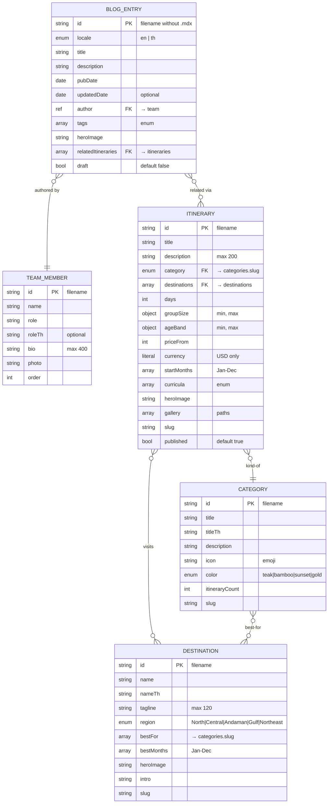

# Database design — flyed marketing site

## 1. Overview

The "database" for the flyed marketing site is best understood as **two layers**:

1. **The filesystem** — markdown / MDX files in `src/content/<collection>/`, loaded by Astro Content Collections at build time using `glob()` loaders, validated by Zod schemas declared in `src/content.config.ts`.
2. **Cloudflare KV** — two namespaces bound to the runtime:
   - `LEADS_KV` — durable per-enquiry record.
   - `RATE_LIMIT_KV` — per-IP sliding window timestamp list.

There is no SQL or document database. Astro DB was mentioned in early design specs but was never wired (`docs/superpowers/specs/2026-06-30-flyed-marketing-site-design.md` is stale on this point — see `.superpowers/sdd/document-audit-2026-07-05.md` §E.1).

```mermaid
flowchart LR
  subgraph Git[Git repo]
    C1[src/content/blog/*.mdx]
    C2[src/content/itineraries/*.mdx]
    C3[src/content/destinations/*.md]
    C4[src/content/categories/*.md]
    C5[src/content/team/*.md]
    S[src/content.config.ts<br/>Zod schemas]
  end
  Build[Astro build]
  KV[(Cloudflare KV)]
  subgraph KVNS[Namespaces]
    LKV[LEADS_KV<br/>key: UUID v4<br/>value: {enquiry, createdAt}]
    RKV[RATE_LIMIT_KV<br/>key: rl:&lt;ip&gt;<br/>value: [ts,…]]
  end
  C1 --> Build
  C2 --> Build
  C3 --> Build
  C4 --> Build
  C5 --> Build
  S -. validates .-> Build
  Build -->|dist/ static| CDN[Cloudflare Workers]
  KVNS --- CDN
```

_Caption: the two persistence layers — git-versioned markdown files for content; KV namespaces for runtime lead capture and rate limiting._

### Engines and versions

| Layer           | Engine / format                                                              | Version                                  | Source                               |
| --------------- | ---------------------------------------------------------------------------- | ---------------------------------------- | ------------------------------------ |
| Build           | Astro                                                                        | 7.x                                      | `package.json:36`                    |
| Content         | Astro Content Collections with `glob({ pattern: '**/*.{md,mdx}', base: … })` | n/a                                      | `src/content.config.ts:23,52,90,107` |
| Validation      | Zod                                                                          | 3.x (5 pending; see `DEPLOY.md:206-208`) | `package.json:41`                    |
| Runtime KV      | Cloudflare KV (KV v1 — by namespace type)                                    | n/a (managed)                            | `wrangler.jsonc:16-27`               |
| Workers runtime | V8 isolates with `nodejs_compat`                                             | `compatibility_date: 2026-06-01`         | `wrangler.jsonc:3`                   |

## 2. Entity-relationship model

### 2.1 Domain overview ERD



_Caption: the five content collections and their FK relationships. The `author` and `relatedItineraries` fields on `BLOG_ENTRY` are cross-collection references resolved at build time via `getEntry()`._

### 2.2 Entity catalog

| Entity          | Purpose                             | Owned by                                | Rows (class)                   | Dictionary link                                              |
| --------------- | ----------------------------------- | --------------------------------------- | ------------------------------ | ------------------------------------------------------------ |
| `blog`          | Marketing blog posts                | `src/content.config.ts` (astro content) | M (40 entries, balanced EN/TH) | [data-dictionary.md §blog](./data-dictionary.md#blog)        |
| `itineraries`   | Trip itineraries with day-by-day    | `src/content.config.ts`                 | S (10 entries)                 | [§itineraries](./data-dictionary.md#itineraries)             |
| `destinations`  | Thai cities / regions               | `src/content.config.ts`                 | S (12 entries)                 | [§destinations](./data-dictionary.md#destinations)           |
| `categories`    | Trip types (Service Learning, etc.) | `src/content.config.ts`                 | S (6 entries)                  | [§categories](./data-dictionary.md#categories)               |
| `team`          | flyed team members                  | `src/content.config.ts`                 | S (8 entries)                  | [§team](./data-dictionary.md#team)                           |
| `LEADS_KV`      | Per-enquiry records                 | Cloudflare KV (runtime)                 | L (depends on traffic)         | [§leads_kv](./data-dictionary.md#leads_kv-runtime)           |
| `RATE_LIMIT_KV` | Per-IP sliding-window timestamps    | Cloudflare KV (runtime)                 | L (one per active IP)          | [§rate_limit_kv](./data-dictionary.md#rate_limit_kv-runtime) |

> **Counts are point-in-time.** As of commit `6830fe4` (2026-07-05): 40 blog entries (20 EN + 20 TH; verified by `ls src/content/blog | wc -l`), 10 itineraries, 12 destinations, 6 categories, 8 team members. Row counts change as Decap editors add content; they are not part of the build contract.

## 3. Identifier and key strategy

- **Content collections:** every entry is keyed by its filename minus extension. Filenames follow a stable pattern: `<NN>-<slug>.en.mdx` or `<NN>-<slug>.th.mdx` for blog posts (commits to the team convention from the migration step `scripts/migrate-blog-i18n.mts`). URLs reuse the filename: `/blog/01-why-thailand-service-learning.en` (the trailing `.en` is dropped in the URL via `id.replace(/\.mdx?$/, '')` — see `src/pages/blog/[slug].astro:18`). The schema author is a `reference('team')` (Zod reference) so the build resolves it to the matching `team` entry.
- **`LEADS_KV`:** keys are generated server-side via `crypto.randomUUID()` (`src/pages/api/enquiry.ts:51`). These are UUIDv4 per `crypto.randomUUID`'s spec.
- **`RATE_LIMIT_KV`:** keys are `rl:<ip>` (string literals constructed at `src/lib/rate-limit.ts:36`).

There is no public/internal ID split for content; the entry `id` (filename slug) is the URL component and the build-time handle. There is no chance of collision because the Decap editor flow forces a unique filename per post.

There is no global `uuid` for KV keys exposed to clients — only `enquiryId` is returned in the API response. That UUID never goes to a public-facing page; it lives in the KV record and is internally useful for log correlation. (Today, logs do not include `enquiryId` because there is no `/admin` lead viewer; only `ctx.logger.error` messages stamp it.)

## 4. Naming and modeling conventions

### Markdown vs MDX

- `src/content/blog/` and `src/content/itineraries/` use `.mdx` (the file bodies include JSX or non-trivial structure).
- `src/content/destinations/`, `src/content/categories/`, and `src/content/team/` use plain `.md` (per the loader glob pattern `'**/*.{md,mdx}'` matching both, but only md in those directories).

### Locale suffix in blog filenames

Blog files use a **per-locale suffix** in the filename — `<slug>.en.mdx` and `<slug>.th.mdx` coexist in the same directory. The merge replaces the prior two-collection split (`blog` and `blogTh` separate collections); see commit `d930b70 refactor(content): merge blog/blogTh into one locale-aware collection` per the audit.

### Boolean defaults

Several schemas declare `z.boolean().default(false)` (e.g., `draft` on blog, `published` on itineraries). This means missing fields in frontmatter are normalized to `false`.

### Slug strategy on collections with `slug` field

`itineraries`, `destinations`, and `categories` each declare their own `slug` field (separate from the entry `id`). The slug is what shows up in URLs (`/itineraries/<slug>`, `/destinations/<slug>`, `/trips/<slug>`). The team convention: slug equals the filename without extension.

`team` and `blog` do not declare a `slug` — the entry `id` (filename) is used directly.

### Region / bestFor / category enums

- `destinations.region` is a fixed 5-value enum (`'North', 'Central', 'Andaman', 'Gulf', 'Northeast'`).
- `categoryEnum` is defined once at `src/content.config.ts:4-11` and reused by `itineraries.category` and `destinations.bestFor`. Same values, single source.
- `curricula` on itineraries is a different enum (`'IB-MYP', 'IB-DP', 'IGCSE', 'A-Level', 'AP', 'GCSE', 'Bilingual'`). Note: `'GCSE'` and `'Bilingual'` are listed but no route consumes `Bilingual` directly today.

### Date handling

- `pubDate` and `updatedDate` (blog) use `z.coerce.date()` so the YAML frontmatter may store either an ISO string or a YAML `!!timestamp` object.
- Dates are rendered via `entry.data.pubDate.toLocaleDateString('en-US', …)` (`src/pages/blog/[slug].astro:35-39`) regardless of locale — the TH blog page does not currently localize dates.

### String constraints

- `description` on blog is `.max(180)`; on itineraries `.max(200)`.
- `tagline` on destinations is `.max(120)`.
- `bio` on team is `.max(400)`.

These are explicit caps; frontmatter that exceeds them fails the build.

### Color enum

Categories declare `color: z.enum(['teak', 'bamboo', 'sunset', 'gold'])` (singular literal CSS-token names). This is coupling between content and design system — a category's color is consumed in component classes (e.g., `bg-bamboo-100`).

### Schema coupling

The schema in `src/content.config.ts` is a _single source of truth_. The Decap CMS configuration (in `public/admin/config.yml` — assumed; not yet read in this work) must mirror it. Any drift between the two causes either build failures (frontmatter the schema rejects) or editor confusion (fields the schema does not advertise).

## 5. Integrity and constraints

### Build-time validation (Zod)

Every content collection runs through its Zod schema at build time. Build fails when:

- A required field is missing.
- A field violates a constraint (e.g., `max(120)`, integer range).
- An enum value does not match (e.g., `category: 'unknown'`).
- A reference cannot resolve (e.g., `relatedItineraries` points to a missing itinerary — `src/pages/blog/[slug].astro:55-60`).

### Service-layer validation

The enquiry endpoint's `enquirySchema` is structurally identical to `EnquiryForm.tsx`'s schema but lives in that file (`src/components/EnquiryForm.tsx:4-22`) and is `import`ed into the handler. This is intentional: client and server share validation.

```ts
// src/pages/api/enquiry.ts
import { enquirySchema } from '@/components/EnquiryForm';
```

### Rate-limit invariants

`RATE_LIMIT_KV` enforces:

- Sliding window of `windowMs` milliseconds.
- Key TTL = `windowMs / 1000` seconds.
- A request is allowed iff `count_of_in_window_timestamps < max`.

The invariants live in `src/lib/rate-limit.ts:30-52`; there is no enforcement at the schema layer (KV does not have a schema).

### Lead invariants

- A lead is written BEFORE any downstream call (KV → Resend → CRM).
- The write key is a UUIDv4.
- The write value is a JSON-serialized `{enquiry, createdAt}` (both fields named explicitly).
- The TTL is 30 days.

## 6. Multi-tenancy and access model

There is **no multi-tenancy**. Content collections are global — there is no `tenant_id` field, no per-tenant scoping, no per-tenant authorization. A "tenant" of one (flyed) owns the entire content set.

> **Risk:** an editor with Decap Cloud access can change any field. There is no field-level role-based access control. This is acceptable for a single-tenant marketing site; flagged as a finding (F-ACCESS-001) in §10.

## 7. Data lifecycle

### 7.1 Migrations

Content is git-versioned. Schema changes land as commits to `src/content.config.ts`. A schema change that adds a required field forces every existing entry to set it before the build can succeed; a schema change that tightens a constraint may break some entries.

A migration script exists at `scripts/migrate-blog-i18n.mts` (referenced from `package.json:19` as `migrate:blog-i18n`). It was used to consolidate the prior `blog` + `blogTh` split into a single `blog` collection with a `locale` field. Tests for it are at `src/lib/migrate-blog-i18n.test.ts`.

### 7.2 Seeding and fixtures

No programmatic seeding — content is hand-authored (or Decap-edited) and committed.

### 7.3 Retention, archival, deletion

| Data class               | Retention                                        | Mechanism                                                     | Notes                                                                                                         |
| ------------------------ | ------------------------------------------------ | ------------------------------------------------------------- | ------------------------------------------------------------------------------------------------------------- |
| Content (markdown / MDX) | Indefinite (versioned in git).                   | Delete the file and commit.                                   | Audit trail: git history.                                                                                     |
| `LEADS_KV` records       | 30 days (TTL set at write).                      | `expirationTtl: 60·60·24·30` (`src/pages/api/enquiry.ts:67`). | No operational retention policy; values may outlive the legal-comfortable period. See OPEN QUESTION OQ-RET-1. |
| `RATE_LIMIT_KV` records  | TTL = `windowMs / 1000` = 60 s (current config). | `expirationTtl` (`src/lib/rate-limit.ts:49`).                 | Self-cleaning.                                                                                                |
| Worker logs              | Per Cloudflare retention policy.                 | n/a                                                           | See NFR-OBS-001 below.                                                                                        |

> **OPEN QUESTION (owner: compliance / legal):** OQ-RET-1 — does the 30-day TTL on `LEADS_KV` satisfy PDPA data-minimization principles? Should there be an explicit `retention_until` field stored alongside the lead so a deletion flow is auditable?

### 7.4 Backup and recovery

- **Content:** git history is the recovery point. There is no separate backup.
- **`LEADS_KV`:** no explicit backup. Recovery is via Cloudflare's event logs only — and that recovery has not been documented. See finding F-DURABILITY-001 in §10.

> **OPEN QUESTION (owner: devops):** OQ-BACKUP-1 — what is the recovery procedure for `LEADS_KV` after a write failure? Today the only durable copy is the request log; is that log exported anywhere that operations can read?

## 8. Query and performance posture

Content collections are loaded once at build time:

| Caller                                  | Loader                                                                           | Filter                                        | Notes                          |
| --------------------------------------- | -------------------------------------------------------------------------------- | --------------------------------------------- | ------------------------------ |
| `src/pages/blog/[...page].astro`        | `getCollection('blog', …)` then `paginate`                                       | `data.locale === 'en' && !data.draft`         | 12 per page.                   |
| `src/pages/blog/[slug].astro`           | `getCollection('blog', …)`                                                       | `data.locale === 'en' && !data.draft`         | One entry per slug.            |
| `src/pages/blog/tag/[tag].astro`        | `getCollection('blog', …)`                                                       | `data.locale === 'en' && !data.draft`         | Filter by tag presence.        |
| `src/pages/rss.xml.ts`                  | `getCollection('blog', …)`                                                       | `!data.draft`                                 | Single-locale feed (EN).       |
| `src/pages/itineraries/[slug].astro`    | `getCollection('itineraries')`                                                   | `data.published`                              | Then `paginate`-equivalent.    |
| `src/pages/destinations/[city].astro`   | `getCollection('destinations')` per param; `getCollection('itineraries')` global | `itin.data.destinations` includes current     | String OR reference matching.  |
| `src/pages/trips/[category].astro`      | `getCollection('itineraries')` + `getCollection('destinations')`                 | `category === slug`; `bestFor.includes(slug)` | Cross-collection join in code. |
| `src/pages/blog/[slug].astro` (related) | cross-collection                                                                 | `data.tags` overlap                           | O(N) tag compare.              |

### Indexing / loaders

Astro Content Collections' `glob()` loaders scan the directory once at build time; there is no materialized index per query — the loader's behavior is "all entries at build" + Zod validation. There is no IndexedDB, no search index. The only "search" the site offers today is the tag-filter chip set on the blog index (`src/pages/blog/[...page].astro:62-75`).

### Performance posture

The blog index computes `allTags` as a global "all-time" set on every page (so the chip set is stable across pagination). For 40 posts this is O(N) and trivial. A migration to 1,000+ posts would make this slow and is worth revisiting.

### Materialized views

None. `destinations` and `categories` are not denormalized into `itineraries`; the cross-collection join is computed in TypeScript at build time on every page that needs it (`src/pages/destinations/[city].astro:32-36`, `src/pages/trips/[category].astro:32-38`).

### Caching

Static pages are pre-rendered into `dist/` and served as-is by the Workers CDN. There is no runtime cache layer beyond the browser cache and the Cloudflare Workers CDN. KV reads count against the request budget but are not cached separately.

## 9. Access, roles, and connections

### Roles

| Role                            | Where                                     | What they can do                      | Source              |
| ------------------------------- | ----------------------------------------- | ------------------------------------- | ------------------- |
| Decap editor                    | `/admin` (Decap Cloud SSO → GitHub OAuth) | Write `src/content/**` via UI commits | `docs/decap-cms.md` |
| Cloudflare operator             | Cloudflare dashboard                      | Edit KV bindings, deploy, roll back   | `DEPLOY.md`         |
| Anonymous visitor               | Public site                               | Read public pages                     | (no auth layer)     |
| GitHub Actions / Workers Builds | CI                                        | Run `astro build` and deploy          | `wrangler.jsonc`    |

### Secrets sources

Environment variables (per `astro.config.mjs:50-65` + `src/env.d.ts`):

| Secret                  | Storage location                                                    | Sensitivity            |
| ----------------------- | ------------------------------------------------------------------- | ---------------------- |
| `RESEND_API_KEY`        | `wrangler secret put RESEND_API_KEY` (per `DEPLOY.md:37`)           | secret                 |
| `CRM_WEBHOOK_URL`       | `wrangler secret put CRM_WEBHOOK_URL`                               | secret                 |
| `ENQUIRY_TO_EMAIL`      | may be set as a public `vars` entry or in `wrangler.jsonc` defaults | public (email address) |
| `PUBLIC_ANALYTICS_HOST` | `wrangler.jsonc` (or `vars`)                                        | public (hostname)      |
| `NODE_ENV`              | `wrangler.jsonc:11`                                                 | public                 |

None of these appear in `wrangler.jsonc` committed to the repo (only `vars: { NODE_ENV: 'production' }` is committed, per `wrangler.jsonc:10-12`).

### Network path

- Visitors → Cloudflare Workers (edge) → static `dist/` assets and `/api/*` SSR endpoints.
- `/api/enquiry` writes to the bound KV namespaces; reading the IAM model — Workers carry the binding at deploy time; no per-request credential involved.

> Never include actual secret values, account IDs, or KV namespace IDs in `/docs`. This document references secrets by name only.

## 10. Findings and risks

| ID                                | Rank   | Statement                                                                                                                                                                                                                                                               | Evidence                                                                |
| --------------------------------- | ------ | ----------------------------------------------------------------------------------------------------------------------------------------------------------------------------------------------------------------------------------------------------------------------- | ----------------------------------------------------------------------- |
| F-DURABILITY-001                  | High   | When `LEADS_KV.put()` throws or the binding is missing, the only durable record of the lead is the Worker request log. There is no documented recovery path for "LEADS_KV is broken and we lost leads".                                                                 | `src/pages/api/enquiry.ts:69-72,74-76`; `DEPLOY.md:199-204`             |
| F-RETENTION-001                   | Medium | The 30-day TTL on `LEADS_KV` records is operational, not regulatory. There is no published retention policy to confirm this satisfies PDPA.                                                                                                                             | `src/pages/api/enquiry.ts:67`                                           |
| F-I18N-BLOG-001                   | Medium | The blog uses one merged collection (`blog`) with a `locale` field. Editors must rename files when adding locale variants (`<slug>.en.mdx`, `<slug>.th.mdx`). A typo in `data.locale` silently hides a post from both locales.                                          | `src/content.config.ts:22-49`; `src/pages/blog/[...page].astro:12`      |
| F-LOG-EMAIL-001                   | Medium | Resend dispatches an email containing the entire enquiry payload (`src/pages/api/enquiry.ts:81-90`). The destination is `ENQUIRY_TO_EMAIL`, defaulting to `sales@flyed.dev` (per `astro.config.mjs:57`). If the secret is misconfigured, the email could land anywhere. | `src/pages/api/enquiry.ts:79-90`; `astro.config.mjs:50-58`              |
| F-ACCESS-001                      | Low    | There is no field-level role-based access on content. Any editor with Decap Cloud invite can edit any field. Acceptable for one-tenant projects.                                                                                                                        | `docs/decap-cms.md`                                                     |
| F-TEST-COVERAGE-001               | Low    | The enquiry endpoint's response status branches are exercised by hand in tests but the rate-limit sliding-window behavior under `RATE_LIMIT_KV` errors has no integration test against a real binding.                                                                  | `tests/e2e/enquiry.spec.ts`; `src/lib/rate-limit.test.ts`               |
| F-CONTACT-MISSING-PERSISTENCE-001 | High   | `/api/contact` accepts and validates contact messages but discards them — no log, no persistence. The Thai-locale contact form has a latent bug — see UC-003 [F-FEAT-003-1](../requirements/use-cases/UC-003-submit-contact-form.md#findings).                          | `src/pages/api/contact.ts:18-21`; `src/components/ContactPage.astro:47` |
| F-I18N-TH-FORMS-001               | High   | The enquiry form (`EnquiryForm.tsx:127`) hard-codes `/api/enquiry` (no locale prefix) — works for both EN and TH because Astro resolves the route by file path. But this design is subtle and undocumented.                                                             | `src/components/EnquiryForm.tsx:127`                                    |
| F-RSS-LOCALE-001                  | Low    | The RSS feed at `/rss.xml` does not filter by locale; it lists all non-draft posts but tagged `<language>en-us</language>` regardless. TH-locale posts appear in a feed labeled EN.                                                                                     | `src/pages/rss.xml.ts:6-21`                                             |

See [data-dictionary.md](./data-dictionary.md) for per-column findings.

## Open questions and assumptions

### Open questions (DB-relevant)

| #       | Question                                                                                                                                                                                                                                    | Owner                |
| ------- | ------------------------------------------------------------------------------------------------------------------------------------------------------------------------------------------------------------------------------------------- | -------------------- |
| OQ-DB-1 | Confirm the 30-day `LEADS_KV` retention is PDPA-compliant; publish a retention policy if so.                                                                                                                                                | legal                |
| OQ-DB-2 | Document the lead-recovery procedure when `LEADS_KV.put()` fails. Today the only durable copy is the request log.                                                                                                                           | devops / engineering |
| OQ-DB-3 | The RSS feed should be either localized (a separate Thai feed) or labeled differently. Confirm preferred design.                                                                                                                            | product              |
| OQ-DB-4 | There is no scheduled backup of `LEADS_KV`. Confirm acceptable.                                                                                                                                                                             | devops               |
| OQ-DB-5 | When `decimales` on image file count grows, the `destinations` page iterates `getCollection('itineraries')` (whole collection) for each `destinations` lookup. At scale, this is O(N·M). Optimize when content reaches hundreds of entries. | engineering          |

### Assumptions

- Each blog filename is unique across EN and TH (no `01-foo` collision when `.en` / `.th` suffixes match). Verified for the 40 committed posts.
- The Zod schema in `src/content.config.ts` is the only build-time gate; the Decap CMS admin config mirrors it.
- Content tags, regions, curricula, and color enums are stable — adding a value requires coordinated changes across content and code.
- The `published` field on `itineraries` defaults to `true`, which is the safer default for marketing-site content (don't gate by default).

## Change history

| Date       | Version | Author              | Summary                                                                                      |
| ---------- | ------- | ------------------- | -------------------------------------------------------------------------------------------- |
| 2026-07-05 | 0.1.0   | docs-architect (AI) | Initial draft. Derived from code at `6830fe4`. Pending product / engineering / legal review. |
