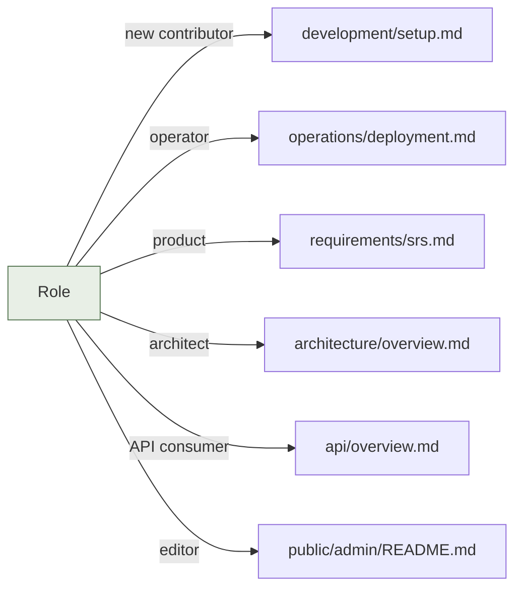

# Documentation index — flyed

Last updated: 2026-07-05 · Generated docs are `status: draft` until human review.

## 1. What is flyed?

flyed is a bilingual (EN + TH) marketing site for inbound educational travel to Thailand — designed for UK and US school decision-makers (heads, teachers, and parents) researching school trips. The site explains the product, captures qualified leads through an enquiry form, and publishes a content surface (blog, destinations, itineraries, team) that ranks in organic search. The marketing surface is pre-rendered Astro static output; the runtime is Cloudflare Workers with two KV namespaces (`LEADS_KV`, `RATE_LIMIT_KV`) and a Decap CMS editorial UI at `/admin`. See [README.md](../README.md) for the high-level overview and current status.

## 2. What to read first (by role)

| Role                  | Start here                                           | Then read                                                                                                                                     |
| --------------------- | ---------------------------------------------------- | --------------------------------------------------------------------------------------------------------------------------------------------- |
| New contributor       | [development/setup.md](development/setup.md)         | [development/onboarding.md](development/onboarding.md) → [development/contributing.md](development/contributing.md)                           |
| Operator / SRE        | [operations/deployment.md](operations/deployment.md) | [operations/runbooks/](operations/runbooks/) (RB-decap-cms, RB-enquiry-429, RB-leads-kv-failure, RB-image-service, RB-rate-limit-kv-eviction) |
| Product / stakeholder | [requirements/srs.md](requirements/srs.md)           | [requirements/functional-spec.md](requirements/functional-spec.md) → [requirements/use-cases/](requirements/use-cases/)                       |
| Architect             | [architecture/overview.md](architecture/overview.md) | [architecture/decisions/](architecture/decisions/) (0001–0005)                                                                                |
| API integrator        | [api/overview.md](api/overview.md)                   | [api/openapi.yaml](api/openapi.yaml)                                                                                                          |
| Editor (Decap)        | [public/admin/README.md](../public/admin/README.md)  | [operations/runbooks/RB-decap-cms.md](operations/runbooks/RB-decap-cms.md)                                                                    |

_Caption: pick the start-point that matches your role; cross-link from there into the rest of the doc tree._

## 3. Documentation map

All entries are `status: draft`, `version: 0.1.0`, `date: 2026-07-05`, AI-generated pending human review, unless explicitly noted otherwise.

| Path                                                                                                                                                            | Type            | Purpose                                                        | Status | Version |
| --------------------------------------------------------------------------------------------------------------------------------------------------------------- | --------------- | -------------------------------------------------------------- | ------ | ------- |
| [README.md](../README.md)                                                                                                                                       | readme          | Project overview, stack, quick links                           | draft  | 0.1.0   |
| [DEPLOY.md](../DEPLOY.md)                                                                                                                                       | deployment      | Production launch runbook (root project doc)                   | draft  | 0.1.0   |
| [AGENTS.md](../AGENTS.md)                                                                                                                                       | onboarding      | Astro dev workflow for AI agents (Claude reads CLAUDE.md)      | draft  | 0.1.0   |
| [CLAUDE.md](../CLAUDE.md)                                                                                                                                       | onboarding      | Symlink to AGENTS.md (Astro-specific dev guidance)             | draft  | 0.1.0   |
| [public/admin/README.md](../public/admin/README.md)                                                                                                             | onboarding      | Editor guide — served at `/admin/README.md`                    | draft  | 0.1.0   |
| [docs/image-prompts.md](image-prompts.md)                                                                                                                       | playbook        | Asset-production prompt library                                | draft  | 0.1.0   |
| [docs/architecture/overview.md](architecture/overview.md)                                                                                                       | architecture    | arc42 system architecture (as-built, Wave 7)                   | draft  | 0.1.0   |
| [docs/architecture/decisions/0001-cloudflare-workers-vs-pages.md](architecture/decisions/0001-cloudflare-workers-vs-pages.md)                                   | adr             | MADR: migrate from Pages to Workers                            | draft  | 0.1.0   |
| [docs/architecture/decisions/0002-kv-namespaces-and-durability.md](architecture/decisions/0002-kv-namespaces-and-durability.md)                                 | adr             | MADR: two KV namespaces + honest `durable` flag                | draft  | 0.1.0   |
| [docs/architecture/decisions/0003-astro-7-static-default-with-opt-in-ssr.md](architecture/decisions/0003-astro-7-static-default-with-opt-in-ssr.md)             | adr             | MADR: `output: 'static'` + per-route SSR                       | draft  | 0.1.0   |
| [docs/architecture/decisions/0004-avif-webp-deferred.md](architecture/decisions/0004-avif-webp-deferred.md)                                                     | adr             | MADR: defer real AVIF/WebP until images ESM-imported           | draft  | 0.1.0   |
| [docs/architecture/decisions/0005-react-19-islands-with-astro-view-transitions.md](architecture/decisions/0005-react-19-islands-with-astro-view-transitions.md) | adr             | MADR: React 19 islands + `<ClientRouter />`                    | draft  | 0.1.0   |
| [docs/api/overview.md](api/overview.md)                                                                                                                         | api             | API overview — conventions, rate-limit, error catalog          | draft  | 0.1.0   |
| [docs/api/openapi.yaml](api/openapi.yaml)                                                                                                                       | api             | OpenAPI 3.1.0 spec (3 paths, 12 schemas)                       | draft  | 0.1.0   |
| [docs/data/database-design.md](data/database-design.md)                                                                                                         | database-design | Data layer (Content Collections + KV) — arc42-style            | draft  | 0.1.0   |
| [docs/data/data-dictionary.md](data/data-dictionary.md)                                                                                                         | data-dictionary | Column-level reference for collections + KV namespaces         | draft  | 0.1.0   |
| [docs/development/setup.md](development/setup.md)                                                                                                               | setup           | Local dev from zero                                            | draft  | 0.1.0   |
| [docs/development/onboarding.md](development/onboarding.md)                                                                                                     | onboarding      | 30-minute first-week repo tour                                 | draft  | 0.1.0   |
| [docs/development/contributing.md](development/contributing.md)                                                                                                 | contributing    | Branch strategy, commit conventions, code style                | draft  | 0.1.0   |
| [docs/operations/deployment.md](operations/deployment.md)                                                                                                       | deployment      | Detailed deploy + rollback procedure (Workers)                 | draft  | 0.1.0   |
| [docs/operations/runbooks/RB-decap-cms.md](operations/runbooks/RB-decap-cms.md)                                                                                 | runbook         | Decap CMS operator runbook (migrated from `docs/decap-cms.md`) | draft  | 0.1.0   |
| [docs/operations/runbooks/RB-enquiry-429.md](operations/runbooks/RB-enquiry-429.md)                                                                             | runbook         | 429 storm diagnosis + mitigation                               | draft  | 0.1.0   |
| [docs/operations/runbooks/RB-leads-kv-failure.md](operations/runbooks/RB-leads-kv-failure.md)                                                                   | runbook         | `durable:false` recovery procedure                             | draft  | 0.1.0   |
| [docs/operations/runbooks/RB-image-service.md](operations/runbooks/RB-image-service.md)                                                                         | runbook         | Astro image-service troubleshooting                            | draft  | 0.1.0   |
| [docs/operations/runbooks/RB-rate-limit-kv-eviction.md](operations/runbooks/RB-rate-limit-kv-eviction.md)                                                       | runbook         | KV TTL/eviction semantics for rate limiter                     | draft  | 0.1.0   |
| [docs/requirements/srs.md](requirements/srs.md)                                                                                                                 | srs             | ISO/IEC/IEEE 29148 SRS — reverse-engineered from code          | draft  | 0.1.0   |
| [docs/requirements/functional-spec.md](requirements/functional-spec.md)                                                                                         | frs             | 15-feature FRS (FEAT-001..015) + traceability                  | draft  | 0.1.0   |
| [docs/requirements/use-cases/UC-001-submit-school-trip-enquiry.md](requirements/use-cases/UC-001-submit-school-trip-enquiry.md)                                 | frs             | Cockburn fully-dressed; 12 Gherkin scenarios                   | draft  | 0.1.0   |
| [docs/requirements/use-cases/UC-002-subscribe-newsletter.md](requirements/use-cases/UC-002-subscribe-newsletter.md)                                             | frs             | Newsletter stub state                                          | draft  | 0.1.0   |
| [docs/requirements/use-cases/UC-003-submit-contact-form.md](requirements/use-cases/UC-003-submit-contact-form.md)                                               | frs             | Contact form; flags F-FEAT-003-1                               | draft  | 0.1.0   |
| [docs/requirements/use-cases/UC-004-browse-content-by-locale.md](requirements/use-cases/UC-004-browse-content-by-locale.md)                                     | frs             | EN/TH content browsing + route filter                          | draft  | 0.1.0   |

### Historical SDD artifacts (`docs/superpowers/`)

These are working documents (specs and plans) preserved for historical context. They are **not** user-facing reference docs and are excluded from the standard quality-gate treatment. Several are materially stale on persistence (Astro DB → LEADS_KV) and on the blog content model (two collections → single locale-aware collection); for current architecture, use the docs under `docs/architecture/`, `docs/api/`, and `docs/data/`.

| Path                                                                                                                                            | Type | Note                                                                                         |
| ----------------------------------------------------------------------------------------------------------------------------------------------- | ---- | -------------------------------------------------------------------------------------------- |
| [docs/superpowers/specs/2026-06-29-navigation-design.md](superpowers/specs/2026-06-29-navigation-design.md)                                     | spec | Navigation component design                                                                  |
| [docs/superpowers/specs/2026-06-30-flyed-marketing-site-design.md](superpowers/specs/2026-06-30-flyed-marketing-site-design.md)                 | spec | Original marketing-site design (partially updated 2026-07-05 for persistence and blog model) |
| [docs/superpowers/specs/2026-07-03-decap-cms-integration-design.md](superpowers/specs/2026-07-03-decap-cms-integration-design.md)               | spec | Decap CMS integration design                                                                 |
| [docs/superpowers/specs/2026-07-04-cloudflare-workers-migration-design.md](superpowers/specs/2026-07-04-cloudflare-workers-migration-design.md) | spec | Workers migration design (live; addendum 2026-07-05)                                         |
| [docs/superpowers/plans/2026-06-29-navigation-implementation.md](superpowers/plans/2026-06-29-navigation-implementation.md)                     | plan | Navigation implementation plan                                                               |
| [docs/superpowers/plans/2026-06-30-flyed-marketing-site-implementation.md](superpowers/plans/2026-06-30-flyed-marketing-site-implementation.md) | plan | Marketing-site implementation plan                                                           |
| [docs/superpowers/plans/2026-07-03-decap-cms.md](superpowers/plans/2026-07-03-decap-cms.md)                                                     | plan | Decap CMS implementation plan                                                                |
| [docs/superpowers/plans/2026-07-04-cloudflare-workers-migration.md](superpowers/plans/2026-07-04-cloudflare-workers-migration.md)               | plan | Workers migration implementation plan                                                        |
| [docs/superpowers/plans/2026-07-04-flyed-improvements.md](superpowers/plans/2026-07-04-flyed-improvements.md)                                   | plan | Wave 7 implementation plan (in progress)                                                     |

## 4. Document control and lifecycle

`status: draft` means content is complete enough to review but may carry `OPEN QUESTION (owner: <role>)` blocks and Assumption markers. To move a document to `in-review`, all OPEN QUESTIONs must be resolved or explicitly accepted as known gaps and at least one named human reviewer must be assigned. To move to `approved`, a human with authority must set that status — AI never sets it. Versioning follows SemVer: PATCH for typos/formatting, MINOR for content additions or corrections, MAJOR for scope/structure changes or reversals of previously approved statements. Promotion path: open a PR that updates the document's YAML front matter; do not mark AI-generated drafts `approved` without human review.

## 5. Open questions index

Consolidated from the four doc-agent delivery reports and the 2026-07-05 audit. Owners are role-based pending a named human owner. Severity: **H**igh / **M**edium / **L**ow — these are priorities for human review.

### Owner: product

| ID         | Question                                                                                                                       | Severity | Source                          |
| ---------- | ------------------------------------------------------------------------------------------------------------------------------ | -------- | ------------------------------- |
| OQ-PROD-1  | Is `DESIGN.md` (gitignored) the canonical private design document?                                                             | M        | audit F.1; arch OPEN QUESTION 1 |
| OQ-PROD-2  | Confirm every `REVIEW NOTE` requirement in `srs.md` §3.1 represents intended behavior (12 to clear).                           | H        | Agent 3 OQ-1                    |
| OQ-PROD-3  | Static office addresses, phone, WhatsApp, Line handle in `ContactPage.astro` — accurate or placeholders?                       | H        | Agent 3 OQ-FRS-1                |
| OQ-PROD-4  | Should the enquiry `notes` field have a length cap?                                                                            | L        | Agent 3 OQ-FRS-4                |
| OQ-PROD-5  | Should blog page-size 12 be config-driven?                                                                                     | L        | Agent 3 OQ-FRS-5                |
| OQ-PROD-6  | Newsletter provider (Resend Audiences / Mailchimp / Buttondown / ConvertKit)? Integration timeline?                            | H        | Agent 3 FR-FORM-008             |
| OQ-PROD-7  | Is the missing persistence on `/api/contact` intentional? Where should messages reach a human?                                 | H        | Agent 3 FR-FORM-010             |
| OQ-PROD-8  | Is Cloudflare's implicit Workers uptime sufficient, or is an explicit SLO required?                                            | M        | Agent 3 NFR-AVL-001             |
| OQ-PROD-9  | WCAG target level and audit cadence (axe-core runs in CI today; no published rules/cadence).                                   | M        | Agent 3 NFR-USAB-004            |
| OQ-PROD-10 | Should `/api/contact` and `/api/newsletter` be rate-limited? They are not today.                                               | M        | arch OPEN QUESTION 9            |
| OQ-PROD-11 | Should partner integrations have an API-key path with a higher rate-limit tier?                                                | L        | arch OPEN QUESTION 11           |
| OQ-PROD-12 | Is the "always 200" pattern on `/api/enquiry` intentional? Should visitors see a 5xx when the enquiry "fails" downstream?      | M        | arch OPEN QUESTION 13           |
| OQ-PROD-13 | Should the team adopt a SemVer release-tag scheme for content pushes?                                                          | L        | Agent 2 OPEN QUESTION           |
| OQ-PROD-14 | No measurements exist for the enquiry / newsletter / contact flows. Establish a baseline?                                      | L        | Agent 3                         |
| OQ-PROD-15 | Is "accept + store durably + dispatch best-effort" the desired enquiry behavior, or should downstream failures degrade to 5xx? | M        | Agent 3                         |

### Owner: legal / compliance

| ID         | Question                                                                                                     | Severity | Source                            |
| ---------- | ------------------------------------------------------------------------------------------------------------ | -------- | --------------------------------- |
| OQ-LEGAL-1 | Does the `LEADS_KV` 30-day retention satisfy PDPA's data-minimization principle? Publish a retention policy. | H        | Agent 3 DB-LEADS                  |
| OQ-LEGAL-2 | Confirm scope of personal data (PII vs. quasi-identifying fields like `schoolName` + `country`).             | H        | Agent 3 NFR-SEC-008               |
| OQ-LEGAL-3 | Confirm intentional no-persistence on contact messages is not a missing feature.                             | H        | Agent 3 FR-FORM-010 / NFR-SEC-002 |
| OQ-LEGAL-4 | Confirm acceptable that `LEADS_KV` records have no backup outside request logs.                              | M        | Agent 3 DB §7.4                   |

### Owner: engineering

| ID        | Question                                                                                                                                                               | Severity | Source               |
| --------- | ---------------------------------------------------------------------------------------------------------------------------------------------------------------------- | -------- | -------------------- |
| OQ-ENG-1  | When images move from `public/images/` to `src/assets/` and get ESM-imported, what is the switch-over plan?                                                            | M        | arch OPEN QUESTION 2 |
| OQ-ENG-2  | Why does `src/env.d.ts:13` default `ENQUIRY_TO_EMAIL` to `sales@flyed.dev` while `DEPLOY.md` §1 hardcodes `hello@flyed.dev`? Are these two addresses?                  | H        | arch OPEN QUESTION 3 |
| OQ-ENG-3  | Where does `durable:false` surface? Without external error tracking, it is only visible in Workers Observability.                                                      | M        | arch OPEN QUESTION 4 |
| OQ-ENG-4  | How does Workers Builds receive the build output — run `npm run build` itself or pull from a published artifact?                                                       | M        | arch OPEN QUESTION 5 |
| OQ-ENG-5  | Confirm CSP / X-Content-Type-Options / Referrer-Policy / HSTS / COEP / COOP / Permissions-Policy at Cloudflare layer (no app-side headers found).                      | H        | Agent 3              |
| OQ-ENG-6  | **F-FEAT-003-1** — Thai-locale contact form posts to `/th/api/contact`, which does not exist. Confirm whether TH-locale contact form works in production.              | H        | Agent 3 UC-003       |
| OQ-ENG-7  | When IP resolves to `"unknown"` all clients share one rate-limit bucket — acceptable for non-CF-proxied environments?                                                  | M        | Agent 3              |
| OQ-ENG-8  | `docs/image-prompts.md` mentions AVIF/WebP but does not link to the AVIF viability decision record.                                                                    | L        | audit F              |
| OQ-ENG-9  | Confirm `AGENTS.md` is a symlink to `CLAUDE.md` before referenced as such.                                                                                             | L        | Agent 3              |
| OQ-ENG-10 | Several FR-FORM and FR-I18N requirements have no automated test — confirm scope of QA gap.                                                                             | M        | Agent 3              |
| OQ-ENG-11 | The first rollback has not been exercised. Treat deployment.md §5 as a draft procedure; refine after the first real rollback.                                          | M        | Agent 2              |
| OQ-ENG-12 | Confirm whether the manual `npx simple-git-hooks` step after clone is intentional or an oversight.                                                                     | L        | Agent 2              |
| OQ-ENG-13 | Add `.nvmrc` to make the Node version explicit (currently `22.12.0` per `package.json` engines).                                                                       | L        | Agent 2              |
| OQ-ENG-14 | Two Lighthouse config files exist (`lighthouserc.json` and `.lighthouserc.json`); confirm canonical and remove the other.                                              | M        | Agent 2              |
| OQ-ENG-15 | Branch protection rules: minimum reviewers? required checks?                                                                                                           | M        | Agent 2              |
| OQ-ENG-16 | Add a `pre-push` hook running `npm run check` and `npm test`.                                                                                                          | L        | Agent 2              |
| OQ-ENG-17 | Add `CODEOWNERS` file for auto-reviewer-assignment as the team grows.                                                                                                  | L        | Agent 2              |
| OQ-ENG-18 | Add a `SECURITY.md` with a private vulnerability-disclosure policy before opening the site to public traffic.                                                          | H        | Agent 2              |
| OQ-ENG-19 | `CMS_GITHUB_TOKEN` is referenced in `DEPLOY.md` but no OAuth handler exists in `src/pages/api/` — confirm whether the secret is reserved for future use or scoped out. | M        | Agent 2              |
| OQ-ENG-20 | Confirm the actual storage quota on `RATE_LIMIT_KV` in the Cloudflare dashboard.                                                                                       | L        | Agent 2              |
| OQ-ENG-21 | Is the current `5 / 60s` rate-limit value the right value for paying customers?                                                                                        | M        | Agent 2              |
| OQ-ENG-22 | Should per-request rate-limit logging be added? Trade-off (log volume vs debuggability).                                                                               | L        | Agent 2              |

### Owner: devops / platform

| ID          | Question                                                                                                                                                                | Severity | Source  |
| ----------- | ----------------------------------------------------------------------------------------------------------------------------------------------------------------------- | -------- | ------- |
| OQ-DEVOPS-1 | Document the lead-recovery procedure when `LEADS_KV.put()` fails in production. Today the only durable copy is the request log.                                         | H        | Agent 3 |
| OQ-DEVOPS-2 | No Lighthouse baseline exists for the live site. CI assertions gate local-build regressions, not live-site targets. Run a `pagespeed.web.dev` audit and record numbers. | M        | Agent 3 |
| OQ-DEVOPS-3 | When `LEADS_KV.put()` fails, is there a log-export path (R2 / S3 / Datadog) for lead recovery?                                                                          | H        | Agent 3 |
| OQ-DEVOPS-4 | Decide whether to wire external alerting (PagerDuty/Slack) on 4xx/5xx, `durable: false`, and 429 rates.                                                                 | M        | Agent 2 |
| OQ-DEVOPS-5 | Confirm the `www → apex` redirect rule still works post-deploy via `curl -I https://www.flyed.dev`.                                                                     | L        | Agent 2 |
| OQ-DEVOPS-6 | Document an expand → migrate → contract pattern for content schema changes if external editors (Decap) become schema-dependent.                                         | L        | Agent 2 |
| OQ-DEVOPS-7 | Confirm the Cloudflare Workers Builds default PR preview URL pattern (`<branch>.<project>.workers.dev`).                                                                | M        | Agent 2 |

### Owner: QA

| ID      | Question                                                                                                                                                                                               | Severity | Source                              |
| ------- | ------------------------------------------------------------------------------------------------------------------------------------------------------------------------------------------------------ | -------- | ----------------------------------- |
| OQ-QA-1 | Several FR-FORM-003 / FR-FORM-007 / FR-FORM-009 / FR-FORM-011 / FR-I18N-003 have no automated test. Add tests for each.                                                                                | M        | Agent 3                             |
| OQ-QA-2 | The enquiry endpoint's response status branches are exercised by hand in tests but the rate-limit sliding-window behavior under `RATE_LIMIT_KV` errors has no integration test against a real binding. | M        | database-design F-TEST-COVERAGE-001 |

### Owner: marketing

| ID       | Question                                                                                                                                                                          | Severity | Source               |
| -------- | --------------------------------------------------------------------------------------------------------------------------------------------------------------------------------- | -------- | -------------------- |
| OQ-MKT-1 | The editor guide (`public/admin/README.md`) lists Slack `#marketing-eng` and GitHub `@flyed-dev` as help channels. Do these exist and have access to a flyed-team-only workspace? | M        | audit F              |
| OQ-MKT-2 | Confirm the marketing-site spec (`docs/superpowers/specs/2026-06-30-flyed-marketing-site-design.md`) rewrite plan (still partly stale on testimonials, real-school-photos).       | M        | arch OPEN QUESTION 6 |

### Owner: docs-architect

| ID        | Question                                                                                                                                                                                                         | Severity | Source  |
| --------- | ---------------------------------------------------------------------------------------------------------------------------------------------------------------------------------------------------------------- | -------- | ------- |
| OQ-DOCS-1 | Should the SDD artifacts (`docs/superpowers/specs/*.md` and `plans/*.md`) be moved under `docs/architecture/decisions/` as ADRs and `docs/superpowers/` deprecated, or kept as a separate SDD working directory? | L        | audit F |
| OQ-DOCS-2 | The Wave 7 plan (`docs/superpowers/plans/2026-07-04-flyed-improvements.md`) has no matching spec — was the spec deliberately omitted?                                                                            | L        | audit F |

### Resolved during this integration pass

| ID    | Question                                                                                                        | Resolution                                                                                                                      |
| ----- | --------------------------------------------------------------------------------------------------------------- | ------------------------------------------------------------------------------------------------------------------------------- |
| RES-1 | `docs/decap-cms.md` referenced Cloudflare Pages and was orphaned in commit `5fe0e2a`.                           | Recovery via cherry-pick; content migrated to `docs/operations/runbooks/RB-decap-cms.md`; all 16 dangling references rewritten. |
| RES-2 | The 2026-06-30 marketing-site spec was stale on Astro DB → LEADS_KV and on the two-collection blog model.       | §8.2 and §8.4 rewritten with current implementation references; header note added.                                              |
| RES-3 | `public/admin/README.md` still referenced Cloudflare Pages preview URLs.                                        | Updated for Workers Builds (`*.workers.dev`), OAuth/CMS_GITHUB_TOKEN, and a link back to RB-decap-cms.md.                       |
| RES-4 | Top-level files (`README.md`, `DEPLOY.md`, `AGENTS.md`) had no YAML front matter and did not point at `/docs/`. | README.md rewritten; DEPLOY.md and image-prompts.md got YAML blocks; AGENTS.md got a single-line pointer to `docs/index.md`.    |
| RES-5 | `docs/index.md` did not exist.                                                                                  | Created (this document).                                                                                                        |

## 6. Change history

| Date       | Version | Author                        | Summary                                                       |
| ---------- | ------- | ----------------------------- | ------------------------------------------------------------- |
| 2026-07-05 | 0.1.0   | docs-architect (AI-generated) | Initial creation during the 2026-07-05 docs integration pass. |
