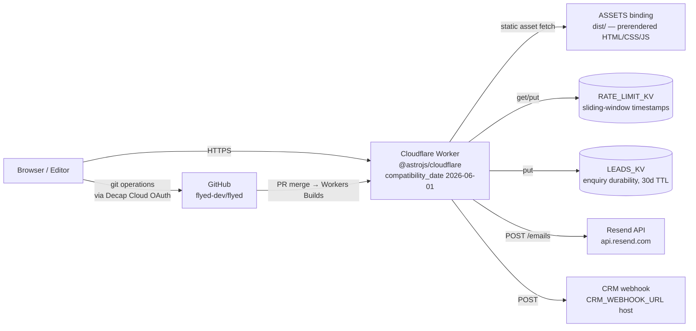

# Deployment — flyed

This document is the operational procedure for the flyed marketing site. It
covers environments, build/release pipeline, deploy and rollback steps,
configuration, observability, and known operational hazards. The pre-launch
checklist (the _first-time_ operator path) lives in `/home/phurix/projects/flyed/DEPLOY.md`
and is intentionally not duplicated here — that file owns the one-time Cloudflare
account and DNS steps; this file owns the recurring operations.

> **Assumption:** The single production target is `https://flyed.dev` (apex) and
> `https://www.flyed.dev` (redirects to apex). Source: `astro.config.mjs:41`
> (`site: 'https://flyed.dev'`) and `/home/phurix/projects/flyed/DEPLOY.md:80-83`
> (the www → apex redirect rule).

## 1. Environment matrix

| Env        | Purpose                                  | URL                                                                                 | Infra                                                   | Data                                                             | Deploy trigger                 |
| ---------- | ---------------------------------------- | ----------------------------------------------------------------------------------- | ------------------------------------------------------- | ---------------------------------------------------------------- | ------------------------------ |
| Production | Public marketing site + `/api/*` runtime | `https://flyed.dev`                                                                 | Cloudflare Workers (Workers Builds, GitHub integration) | Real form submissions to `LEADS_KV`, real emails via Resend      | Push to `main` after CI passes |
| Preview    | Per-branch preview for PR review         | `<branch>.<project>.workers.dev` (Workers Builds default) and preview KV namespaces | Cloudflare Workers Builds (preview environment)         | Anonymized / preview `LEADS_KV` + `RATE_LIMIT_KV` namespaces     | PR opened against `main`       |
| Local dev  | Engineer workstation                     | `http://localhost:4321`                                                             | Astro dev server (no Worker runtime)                    | No KV bindings; Resend/CRM calls are no-ops when env vars absent | `npm run dev`                  |

> **OPEN QUESTION (owner: engineering):** The pre-Workers-migration runbook
> referenced "CF Pages branch deploys" at `https://<branch>--flyed-dev.pages.dev`
> (see `/home/phurix/projects/flyed/docs/superpowers/specs/2026-07-04-cloudflare-workers-migration-design.md:79-84`).
> The current default URL shape under Workers Builds is the workers.dev branch
> alias, but the team has not documented which exact URL pattern reviewers should
> expect for a PR preview today. Confirm with whoever configured the Workers
> project in the Cloudflare dashboard.

## 2. Topology

The runtime is a single Cloudflare Worker that serves prerendered static
assets and a small number of per-route SSR endpoints (`/api/*`, `/admin/*`
static shell). Two KV namespaces sit beside the Worker for state.



**Why the topology looks like this:**

- `output: 'static'` (`astro.config.mjs:42`) pre-renders every page at build time;
  only routes that opt in via `export const prerender = false` run as Worker
  functions. Evidence: `/home/phurix/projects/flyed/src/pages/api/enquiry.ts:7`,
  `newsletter.ts:4`, `contact.ts:5` all set `prerender = false`; the page
  wrappers under `/home/phurix/projects/flyed/src/pages/` use `prerender = true`.
- The Cloudflare adapter (`@astrojs/cloudflare`, declared at
  `astro.config.mjs:43-48`) is retained so the per-route SSR endpoints still
  deploy as Worker functions.
- The Decap CMS shell (`/admin`) is served as a static asset from the ASSETS
  binding; no Worker function runs for the shell HTML
  (`/home/phurix/projects/flyed/public/_redirects:26-32`).

## 3. Build and release pipeline

The pipeline runs in two layers: GitHub Actions runs lint, typecheck, unit
tests, e2e, and Lighthouse CI; Cloudflare Workers Builds runs the actual
production deploy from the merged `main`.

### 3.1 GitHub Actions (`.github/workflows/ci.yml`)

| Job               | Trigger                        | What it does                                                                                                      | Gate behavior                                         |
| ----------------- | ------------------------------ | ----------------------------------------------------------------------------------------------------------------- | ----------------------------------------------------- |
| `lint-build-test` | push to `main` or PR to `main` | `npm ci`, `npm run check` (Astro check + tsc), `npm run build`, `npm test` (Vitest)                               | blocks downstream jobs on failure                     |
| `e2e`             | needs `lint-build-test`        | installs Playwright Chromium, builds, runs Playwright against the prerendered `dist/client/` (Python http.server) | uploads Playwright HTML report as artifact on failure |
| `lighthouse`      | needs `lint-build-test`        | builds, serves `dist/client/`, runs `lhci autorun` against 11 URLs                                                | uses temporary public storage for assertions          |

### 3.2 Cloudflare Workers Builds

Workers Builds is configured to build from `flyed-dev/flyed@main`. The build
command, output directory, and runtime settings live in the Cloudflare
dashboard (not in this repo); the canonical pre-launch values are documented
in `/home/phurix/projects/flyed/DEPLOY.md:30-35`.

| Setting                | Value           | Source                                                                   |
| ---------------------- | --------------- | ------------------------------------------------------------------------ |
| Build command          | `npm run build` | `package.json:11`                                                        |
| Build output directory | `dist`          | `wrangler.jsonc:7-9` (ASSETS directory)                                  |
| Root directory         | `/`             | `DEPLOY.md:32`                                                           |
| Node version           | 22              | `package.json:6-8` (`engines.node >= 22.12.0`); `ci.yml:19` pins Node 22 |
| Compatibility date     | `2026-06-01`    | `wrangler.jsonc:3`                                                       |
| Compatibility flags    | `nodejs_compat` | `wrangler.jsonc:4`                                                       |

### 3.3 Versioning and tags

> **OPEN QUESTION (owner: engineering):** No git tag or release process is
> documented for this site. Cloudflare Workers Builds tags each deployment with
> the commit SHA by default; no SemVer tag scheme exists. Confirm whether the
> team wants release tags before adopting a formal rollback-by-tag procedure.

## 4. Deploy procedure

> **How-to register.** Numbered steps with verification after each risky
> action. Preconditions at the top, rollback in section 5.

### 4.1 First-time prerequisites (one-time setup)

These are the one-time Cloudflare account and binding-creation steps. They are
duplicated from `/home/phurix/projects/flyed/DEPLOY.md:11-66` for self-containedness
of this doc and cross-linked so DEPLOY.md remains the single source of truth.

1. **Cloudflare account + custom domain.** Follow
   `/home/phurix/projects/flyed/DEPLOY.md:11-22` to create the account, add the
   domain, and create the API token scoped to the Workers template.
2. **GitHub repo secrets.** Add `CLOUDFLARE_API_TOKEN` and `CLOUDFLARE_ACCOUNT_ID`
   to the repo (Settings → Secrets and variables → Actions). Optional:
   `LHCI_TOKEN` for public Lighthouse storage uploads.
3. **Connect repo to Workers.** Workers Builds → Connect GitHub repo
   `flyed-dev/flyed`. Use the build settings from
   `/home/phurix/projects/flyed/DEPLOY.md:30-35`.
4. **Create KV namespaces.** The `wrangler.jsonc` in this repo contains
   placeholder ids (`0000…01` for `RATE_LIMIT_KV`, `0000…02` for `LEADS_KV`,
   `wrangler.jsonc:18-27`). Until real ids are patched in, the build succeeds
   but the runtime degrades silently:

   ```bash
   npx wrangler kv namespace create RATE_LIMIT_KV
   npx wrangler kv namespace create LEADS_KV
   npx wrangler kv namespace create RATE_LIMIT_KV --preview
   npx wrangler kv namespace create LEADS_KV --preview
   ```

   Paste each command's `id` into `id` and the `--preview` output into
   `preview_id` in `/home/phurix/projects/flyed/wrangler.jsonc`. Commit the
   change. **Verification:** `wrangler.jsonc` no longer contains any
   `000000000000000000000000000000` placeholder.

5. **Set secrets and env vars** (per the env table in section 6 below):
   - `wrangler secret put RESEND_API_KEY`
   - `wrangler secret put CRM_WEBHOOK_URL`
   - `wrangler secret put ENQUIRY_TO_EMAIL` only if you want to override the
     `sales@flyed.dev` default in `/home/phurix/projects/flyed/astro.config.mjs:57`.
   - `PUBLIC_ANALYTICS_HOST` is a **plain var** (not secret) — set it via
     `wrangler var` or in the Workers dashboard if using Plausible.
6. **DNS + SSL.** Apex `A` and `www` `CNAME` per `DEPLOY.md:66-83`. SSL/TLS
   Full (strict), Always Use HTTPS ON, Minimum TLS 1.2. The www → apex
   redirect MUST be configured in the dashboard — `public/_redirects` cannot
   express absolute redirects.

### 4.2 Routine deploy

The deploy itself is automatic once CI is green.

```bash
# 1. Cut a feature branch off main
git checkout main
git pull origin main
git checkout -b <type>/<scope>

# 2. Make the change, push, open PR
git push -u origin HEAD
gh pr create --fill

# 3. CI runs lint → typecheck → build → unit → e2e → lighthouse
#    (see .github/workflows/ci.yml). All must pass before merge is allowed.

# 4. Merge via PR review. Cloudflare Workers Builds picks up the merge to main.
```

> **Verification:** Within ~2 minutes of merge, the new deployment appears at
> Cloudflare Dashboard → Workers & Pages → flyed → Deployments. The previous
> deployment is still listed as "Active" until the new one finishes.

### 4.3 Post-deploy verification

The full smoke-test checklist lives in `/home/phurix/projects/flyed/DEPLOY.md:94-156`.
This doc surfaces only the items most likely to silently regress:

- [ ] `curl -fsS https://flyed.dev/` returns 200 with the hero headline in the
      HTML. (Confirms the static prerender + ASSETS binding wired correctly.)
- [ ] `curl -fsS -X POST -H 'Content-Type: application/json' \
     -d '{"schoolName":"Test","role":"Teacher","email":"a@b.co","phone":"1234567","country":"US","groupSize":10,"ages":"14","departureMonth":"Jun","duration":7,"subjects":["service-learning"]}' \
     https://flyed.dev/api/enquiry` returns `{"ok":true,"enquiryId":"<uuid>","durable":true}`.
      A response with `"durable":false` is the LEAD_KV failure signal — see
      `docs/operations/runbooks/RB-leads-kv-failure.md`.
- [ ] `curl -fsS https://flyed.dev/th/` returns 200 with `<html lang="th">`.
      A missing `/th/404.html` file would 500 here for unknown TH paths; the
      `th-404-copy` Vite plugin in `astro.config.mjs:22-38` emits it on build.
- [ ] `curl -fsS https://flyed.dev/admin/` returns 200 with `<title>flyed</title>`
      and a `decap-cms` script tag.

### 4.4 Migration / data-shape changes

There are no traditional database migrations in this project — the data layer
is Astro Content Collections (files in `/home/phurix/projects/flyed/src/content/`)
backed by Zod schemas in `/home/phurix/projects/flyed/src/content.config.ts`.
A schema change is a code change: edit the Zod schema, run `npm run check`,
the build fails loudly if existing content is invalid.

> **OPEN QUESTION (owner: engineering):** No formal expand → migrate → contract
> pattern is documented for content schema changes. In practice, schema changes
> have been atomic (single PR, merge breaks the build until content is fixed).
> This is acceptable for a single-team blog but should be revisited if external
> editors (Decap CMS) start depending on a specific schema.

## 5. Rollback procedure

> **How-to register.** Two rollback paths — pick the one that matches the
> urgency. Rollback changes the _runtime_, not the _repo_; follow with a fix.

### 5.1 Dashboard rollback (preferred for fast recovery)

1. Cloudflare Dashboard → Workers & Pages → flyed → Deployments.
2. Find the last successful deployment (Workers lists them newest-first).
3. Click "..." → "Rollback to this deploy".
4. **Verification:** `curl -fsS https://flyed.dev/` returns the previously
   serving HTML (compare `git log` to the rolled-back SHA's commit time).

### 5.2 CLI rollback

```bash
wrangler deployments list --name=flyed
# Note the deployment-id of the last good deploy
wrangler deployments rollback <deployment-id> --name=flyed
```

### 5.3 What cannot be rolled back

- **KV state.** Rolling back the Worker does not revert KV writes that the
  failing deploy made. If `LEADS_KV` was being overwritten by a broken
  handler, the only recovery is manual re-entry or a KV snapshot. The
  default TTL on enquiry keys is 30 days
  (`/home/phurix/projects/flyed/src/pages/api/enquiry.ts:66`); TTL is long
  enough that a snapshot is feasible only if you trigger one promptly.
- **DNS / Cloudflare configuration.** Changes to the custom domain, SSL
  mode, redirect rules, or Workers KV namespaces are not part of the Worker
  deployment and must be reverted manually in the dashboard.

> **Risk:** Rollback is **untested** at the time of writing (no post-launch
> exercise has occurred). The procedure matches `/home/phurix/projects/flyed/DEPLOY.md:175-188`
> but has not been exercised end-to-end. Treat the first rollback as a drill.

## 6. Configuration and secrets

The site uses `astro:env` (see `/home/phurix/projects/flyed/astro.config.mjs:49-66`
and `/home/phurix/projects/flyed/src/env.d.ts:5-22`) for typed env access.
The schema distinguishes server-context (secrets) from client-context (vars
bundled into the client).

### 6.1 Env var table

| Name                    | Context | Access | Default                           | Where set in prod                             | Source of truth          |
| ----------------------- | ------- | ------ | --------------------------------- | --------------------------------------------- | ------------------------ |
| `RESEND_API_KEY`        | server  | secret | (none; required for email)        | `wrangler secret put RESEND_API_KEY`          | `astro.config.mjs:51`    |
| `CRM_WEBHOOK_URL`       | server  | secret | (none; required for CRM dispatch) | `wrangler secret put CRM_WEBHOOK_URL`         | `astro.config.mjs:52`    |
| `ENQUIRY_TO_EMAIL`      | server  | public | `sales@flyed.dev`                 | optional override via `wrangler secret put`   | `astro.config.mjs:53-58` |
| `PUBLIC_ANALYTICS_HOST` | client  | public | (none; optional)                  | Workers dashboard "Variables and Secrets" tab | `astro.config.mjs:59-64` |
| `SITE_URL`              | n/a     | n/a    | `https://flyed.dev`               | `astro.config.mjs:41` (`site:` field)         | `astro.config.mjs:41`    |
| `NODE_ENV`              | n/a     | n/a    | `production`                      | `wrangler.jsonc:11`                           | `wrangler.jsonc:11`      |

> **Assumption:** `SITE_URL` and `NODE_ENV` are not `astro:env` variables —
> they live as static config and the `wrangler.jsonc` `vars` block respectively.
> The site's canonical URL also appears in
> `/home/phurix/projects/flyed/src/layouts/Layout.astro:22` as a fallback if
> `Astro.site` is unset. Hard rule: no real secret values are reproduced here
> — secret _names_ and _locations_ only.

### 6.2 KV namespace bindings

| Binding         | Purpose                                                                 | Source                                                            |
| --------------- | ----------------------------------------------------------------------- | ----------------------------------------------------------------- |
| `RATE_LIMIT_KV` | Sliding-window IP rate limit for `POST /api/enquiry` (5 requests / 60s) | `wrangler.jsonc:18-21`; usage at `src/pages/api/enquiry.ts:34-41` |
| `LEADS_KV`      | Durable enquiry record, 30-day TTL, key = `enquiryId`                   | `wrangler.jsonc:23-26`; usage at `src/pages/api/enquiry.ts:59-76` |

> **No R2 is currently configured.** No `r2_buckets` block exists in
> `/home/phurix/projects/flyed/wrangler.jsonc`. If the team later moves blog
> uploads from the GitHub-tracked `public/images/uploads/` to R2, add an
> `r2_buckets` block and create the bucket before deploying.

### 6.3 Build-time vs runtime

- `astro:env/server` values are only available inside the runtime (Worker).
  `src/pages/api/enquiry.ts` is the only consumer; prerendered pages do not
  read these.
- `astro:env/client` values are bundled into the client. `PUBLIC_ANALYTICS_HOST`
  is the only client var.
- The Vite plugin `th-404-copy` in `astro.config.mjs:22-38` runs at build
  time and copies `dist/th/404/index.html` to `dist/th/404.html` so the
  Worker ASSETS binding serves a TH 404 for `/th/foo` requests.

## 7. Observability

### 7.1 Logs

- **Worker logs:** `wrangler tail` for live tailing during dev. In production,
  Cloudflare Logs are available at Workers → flyed → Logs. The `ctx.logger`
  call sites in `/home/phurix/projects/flyed/src/pages/api/enquiry.ts:43, 70, 75, 92, 97, 109, 114`
  emit warnings (`Rate limit exceeded`, `LEADS_KV not bound`, `Resend delivery failed`)
  and errors (`LEADS_KV put failed`, `CRM webhook failed`). All log messages
  carry an `enquiryId` for correlation.
- **Structured observability:** `wrangler.jsonc:28-31` enables
  `observability` with `head_sampling_rate: 1` — every request is sampled.

### 7.2 Metrics and alerts

> **OPEN QUESTION (owner: engineering):** No external alerting is configured.
> The audit (`/home/phurix/projects/flyed/.superpowers/sdd/document-audit-2026-07-05.md:102`)
> flags that `DEPLOY.md` lists monitoring checkboxes but no concrete alert
> wiring. The Cloudflare dashboard exposes 4xx/5xx rate and P95 latency under
> Workers → flyed → Analytics; an external hook (PagerDuty, Slack) has not
> been configured. Decide whether the on-call story for this site is "watch
> the dashboard" or wire an external pager.

### 7.3 Form submission monitoring

The enquiry handler always returns 200 (success shape) even when downstream
dispatch fails — see `/home/phurix/projects/flyed/src/pages/api/enquiry.ts:117-125`.
The signal that something went wrong is the `durable: false` field, not the
HTTP status. Monitoring must check both:

| Outcome                        | `ok`    | `durable` | HTTP status |
| ------------------------------ | ------- | --------- | ----------- |
| KV + Resend + CRM all OK       | `true`  | `true`    | 200         |
| KV OK, downstream failed       | `true`  | `true`    | 200         |
| KV put threw or binding absent | `true`  | `false`   | 200         |
| Rate limit exceeded            | `false` | n/a       | 429         |
| JSON parse error               | `false` | n/a       | 400         |
| Zod validation error           | `false` | n/a       | 422         |

> **Operational hazard:** A `200 { durable: false }` means the lead is **only**
> in the request log. There is no second copy. Recovery requires log-export
> plumbing (Cloudflare Logpush → object storage → manual CSV → CRM re-entry).
> See `docs/operations/runbooks/RB-leads-kv-failure.md`.

## 8. Scheduled and background operations

There are no cron-style scheduled jobs in this project. The complete inventory
of recurring runtime operations is:

| Operation                            | Trigger                  | What it does                                | Failure impact                                                      | Runbook                                             |
| ------------------------------------ | ------------------------ | ------------------------------------------- | ------------------------------------------------------------------- | --------------------------------------------------- |
| `POST /api/enquiry` rate limit check | per request              | Sliding-window 5/60s                        | 429 storm if KV evicts                                              | `RB-rate-limit-kv-eviction.md`, `RB-enquiry-429.md` |
| Enquiry durability write             | per accepted request     | `LEADS_KV.put` with 30-day TTL              | `durable: false` returns; lead only in logs                         | `RB-leads-kv-failure.md`                            |
| Resend email send                    | per accepted request     | `fetch api.resend.com/emails`               | log error only; lead is still in KV                                 | (none — best-effort, see §7.3)                      |
| CRM webhook POST                     | per accepted request     | `fetch CRM_WEBHOOK_URL`                     | log error only; lead is still in KV                                 | (none — best-effort, see §7.3)                      |
| Workers Builds rebuild               | push to `main`           | npm install + `astro build` + Worker upload | site continues serving previous build until fix                     | n/a (CI gates)                                      |
| Lighthouse CI run                    | push/PR to `main`        | asserts thresholds in `lighthouserc.json`   | CI fails; no prod impact unless merged                              | n/a                                                 |
| Decap CMS PR creation                | editor saves in `/admin` | Decap Cloud → git → PR                      | branch preview fails to render if `cms/*` branch has a schema error | `RB-decap-cms.md`                                   |

> **Open:** the bottom row ("PR creation") is editor-driven, not system-driven,
> but it has the same operational blast radius as a Workers deploy from a
> content perspective. `RB-decap-cms.md` is the canonical place to handle it.

## Open questions and assumptions

> **Assumption:** All "as-built" claims in this document were verified by
> reading the file paths cited inline. Where verification was not possible
> (e.g. the live Cloudflare dashboard state), the claim is flagged as an OPEN
> QUESTION.

> **OPEN QUESTION (owner: engineering):** Confirm the Cloudflare Workers
> Builds default PR preview URL pattern (`<branch>.<project>.workers.dev`).
> The pre-migration spec used a Pages-style URL (`<branch>--flyed-dev.pages.dev`),
> which is now stale.

> **OPEN QUESTION (owner: engineering):** Should the team adopt a release-tag
> scheme (SemVer) for content pushes, or rely on Workers' default
> per-commit SHA tagging? No current practice is documented.

> **OPEN QUESTION (owner: engineering):** The first rollback has not been
> exercised. Treat section 5 as a draft procedure; refine after the first
> real rollback.

> **OPEN QUESTION (owner: engineering):** Decide whether to wire external
> alerting (PagerDuty / Slack) on 4xx/5xx rate, `durable: false` response
> rate, and 429 rate. Today the only signal is "someone notices".

> **OPEN QUESTION (owner: engineering):** The `www → apex` redirect is set in
> the Cloudflare dashboard (because `public/_redirects` cannot express
> absolute redirects — see `/home/phurix/projects/flyed/public/_redirects:1-32`
> and `/home/phurix/projects/flyed/DEPLOY.md:78-83`). Add a step to the
> post-deploy verification that confirms a `curl -I https://www.flyed.dev`
> returns a 301 to the apex.

> **OPEN QUESTION (owner: engineering):** The schema-change handling for
> content collections is implicit (build-time Zod validation). Document an
> expand → migrate → contract pattern if external editors (Decap) become
> schema-dependent.

## Change history

| Date       | Version | Author                                              | Summary                                                                                           |
| ---------- | ------- | --------------------------------------------------- | ------------------------------------------------------------------------------------------------- |
| 2026-07-05 | 0.1.0   | docs-architect (AI-generated, pending human review) | Initial draft, split from `/home/phurix/projects/flyed/DEPLOY.md` per audit recommendation C.1.4. |
