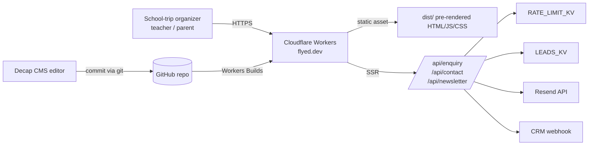

# Software requirements specification — flyed marketing site

## 1. Introduction

### 1.1 Purpose

This SRS specifies the flyed marketing site — an Astro 7 static site with per-route SSR for `/api/*` endpoints, deployed to Cloudflare Workers, with KV namespaces for lead capture and rate limiting. It is the canonical reference for _what the system does_, and is required reading for product decisions, compliance reviews, and new-engineer onboarding.

> **REVIEW NOTE:** This SRS was reverse-engineered from the codebase at commit `6830fe4` (branch `wave-7-improvements`, dated 2026-07-05). Every requirement marked `REVIEW NOTE` was inferred from code — the business intent is not stated in any existing document. This document is **pending product-owner review**; treat functional requirements as proposals until a stakeholder signs off.

The intended use of this document is:

- Product / marketing owners confirm the requirement statements match what the site must do.
- Engineering confirms the requirement statements match what the site does today.
- Compliance / legal use it to assess personal-data flows (PDPA-relevant: see §1.3.4, §3.7.3).

### 1.2 Scope

The system **shall**:

- Render the flyed marketing surface in English (default) and Thai (under `/th/*`) using Astro Content Collections for blog posts, itineraries, destinations, categories, and team profiles.
- Capture school-trip enquiries through a 5-step wizard at `/enquire` (and `/th/enquire`) and persist them to the `LEADS_KV` Cloudflare KV namespace before dispatching email (Resend) and CRM webhook deliveries.
- Capture newsletter sign-ups and contact messages through smaller forms.
- Apply an IP-keyed sliding-window rate limit (`RATE_LIMIT_KV`) to the enquiry endpoint.
- Be served from Cloudflare Workers (`compatibility_date: 2026-06-01`, `nodejs_compat`), with static content pre-rendered at build time and only `/api/*` running on the edge.

The system **shall NOT**:

- Process payments, take deposits, or hold booking state.
- Authenticate end-users (no login / student accounts / dashboards).
- Serve dynamic per-user pages (all marketing pages are pre-rendered).
- Wire a newsletter delivery provider (the `/api/newsletter` endpoint accepts an email and returns `ok: true` with a 100 ms simulated delay; no provider is integrated as of this writing — see `src/pages/api/newsletter.ts:8-19`).

### 1.3 Product overview

#### 1.3.1 Product perspective

The flyed site is an **independent system** in the broader flyed sales pipeline. It produces leads; downstream systems (Resend for transactional email, an external CRM via webhook) consume them. There is no inbound integration with the CRM (lead state is not read back into the site).

_Caption: visitor, editor, and downstream-system relationships — what the system talks to and which direction._

The site uses:

- **No database.** Astro Content Collections read markdown / MDX files from the repository at build time (`src/content.config.ts:1-131`); runtime writes go to Cloudflare KV.
- **No authentication for visitors.** Decap CMS uses GitHub as its identity provider via Decap Cloud (per `docs/operations/runbooks/RB-decap-cms.md`).
- **No server-side session state.** Every request is independent.

#### 1.3.2 Product functions

| Function group                   | Purpose                                                                   | Evidence                                                                        |
| -------------------------------- | ------------------------------------------------------------------------- | ------------------------------------------------------------------------------- |
| Marketing content                | Publish itineraries, destinations, blog posts, team profiles, legal pages | `src/content.config.ts:51-129`                                                  |
| Audience segmentation            | Render three persona pages (schools, parents, educators)                  | `src/pages/{schools,parents,educators}.astro`                                   |
| Lead capture — itinerary enquiry | Multi-step form → lead in KV → email + CRM dispatch                       | `src/pages/api/enquiry.ts`, `src/components/EnquiryForm.tsx`                    |
| Lead capture — contact           | Simple message form                                                       | `src/pages/api/contact.ts`, `src/components/ContactPage.astro`                  |
| Lead capture — newsletter        | Email sign-up (no provider)                                               | `src/pages/api/newsletter.ts`, `src/components/NewsletterForm.tsx`              |
| Internationalization             | Render every page in EN (default) and TH (`/th/*`)                        | `astro.config.mjs:67-73`, `src/i18n/index.ts`                                   |
| Editorial workflow               | Decap CMS at `/admin` writes to git                                       | `docs/operations/runbooks/RB-decap-cms.md`                                      |
| Discoverability                  | Sitemap at `/sitemap-index.xml`, RSS at `/rss.xml`, hreflang alternates   | `astro.config.mjs:95`, `src/pages/rss.xml.ts`, `src/layouts/Layout.astro:78-99` |

#### 1.3.3 User characteristics

| Class               | Role                                                                 | Frequency            | Privileges                                    | Auth               |
| ------------------- | -------------------------------------------------------------------- | -------------------- | --------------------------------------------- | ------------------ |
| Anonymous visitor   | Prospective school-trip organizer (teacher / parent / administrator) | Ad-hoc               | Read all public pages; submit forms           | None               |
| Decap editor        | Marketing team member                                                | Daily                | Write to `src/content/**` via git             | Decap Cloud SSO    |
| Cloudflare operator | Engineering                                                          | On deploy / incident | Bind KV namespaces, roll back deploys         | Cloudflare account |
| Marketing analyst   | Marketing                                                            | Reads dashboards     | None directly; reads Cloudflare Web Analytics | Cloudflare account |

> **Assumption:** Decap editors do not require a separate per-edit session token; the GitHub OAuth flow is the identity layer. — based on `docs/operations/runbooks/RB-decap-cms.md`. Confirm with `owner: engineering`.

#### 1.3.4 Limitations

The system operates under the following constraints:

- **Cloudflare Workers runtime limits.** Single request budget, per-worker CPU and memory quotas, and no long-lived connections. Astute code per route (`src/pages/api/enquiry.ts:8-126` demonstrates the write-before-dispatch pattern).
- **KV durability semantics.** `LEADS_KV` is Cloudflare's eventually-consistent key-value store. The handler treats `LEADS_KV.put()` success as the durability boundary (`src/pages/api/enquiry.ts:53-76`); when the binding is absent (local `astro dev`) the `durable: false` flag travels back in the response.
- **Astro static output with per-route SSR.** Every page except `/api/*` and `/admin/*` is pre-rendered at build time; personalization beyond locale is impossible without a rebuild.
- **No CMS-side auth gate beyond git.** Anyone with the Decap Cloud invite can write a content commit; there is no role-based access control at the field level.
- **Personal-data handling.** The enquiry form collects the following PII (verified by reading the schema at `src/components/EnquiryForm.tsx:4-22`): school name, role, email, phone, country, group size, ages. PDPA (Thailand) and equivalent jurisdictions apply. See §3.7.3.

> **OPEN QUESTION (owner: legal):** Does flyed have a published data-retention policy for `LEADS_KV` entries? The current `expirationTtl` is `60 * 60 * 24 * 30` (30 days), set at `src/pages/api/enquiry.ts:67` — confirm whether 30 days is compliant with PDPA or operational needs.

### 1.4 Definitions

| Term                          | Definition                                                                                                                                                                                                          |
| ----------------------------- | ------------------------------------------------------------------------------------------------------------------------------------------------------------------------------------------------------------------- |
| **Astro Content Collections** | Astro's type-safe content loader; reads markdown / MDX files at build time and validates each entry against a Zod schema. See [Astro docs on Collections](https://docs.astro.build/en/guides/content-collections/). |
| **Astro `output: 'static'`**  | Build mode that pre-renders all pages to HTML files; runtime routes opt back into SSR via `export const prerender = false;`. See `astro.config.mjs:42`.                                                             |
| **Astro island**              | A framework component (here: React 19) embedded in an otherwise-static page, hydrated per `client:*` directive. See `src/components/EnquiryForm.tsx` for an island example.                                         |
| **Cloudflare KV**             | Eventually-consistent key-value store bound to a Worker via a `binding`; read/write via `get()` / `put()` with optional `expirationTtl`. Declared in `wrangler.jsonc:16-27`.                                        |
| **Cloudflare Workers**        | Edge V8 isolates running on Cloudflare's network. The build target for `output: 'static'` + per-route SSR via `wrangler.jsonc`.                                                                                     |
| **Decap CMS**                 | Git-backed headless CMS (formerly Netlify CMS); editors commit to the repo through a UI. See `docs/operations/runbooks/RB-decap-cms.md`.                                                                            |
| **Enquiry**                   | A school-trip enquiry submitted via `/enquire`; one record per submission. Schema: `src/components/EnquiryForm.tsx:4-22`.                                                                                           |
| **Hreflang**                  | `<link rel="alternate" hreflang="...">` markup linking each page to its locale alternate. See `src/layouts/Layout.astro:78-99`.                                                                                     |
| **i18n**                      | Internationalization; in this project, English (`en`, default, served at `/`) and Thai (`th`, served at `/th/*`).                                                                                                   |
| **Lead**                      | An enquiry record persisted to `LEADS_KV`, keyed by a UUIDv4 generated at submission (`src/pages/api/enquiry.ts:51`).                                                                                               |
| **LEADS_KV**                  | Cloudflare KV namespace binding the enquiry handler uses to durably persist leads. See `wrangler.jsonc:23-26`.                                                                                                      |
| **Lighthouse CI (LHCI)**      | Programmatic Lighthouse runner; configured at `lighthouserc.json`.                                                                                                                                                  |
| **MDX**                       | Markdown + JSX; used for blog posts and itinerary day-by-day bodies.                                                                                                                                                |
| **PII**                       | Personally identifiable information. The enquiry form is PII-bearing; see §3.7.3.                                                                                                                                   |
| **PDPA**                      | Thailand's Personal Data Protection Act, B.E. 2562 (2019). Applies to any PII collected from data subjects in Thailand.                                                                                             |
| **Rate limit**                | A sliding-window per-IP throttle on the enquiry endpoint: max 5 requests per 60 s. See `src/lib/rate-limit.ts:39-51` and `src/pages/api/enquiry.ts:36-41`.                                                          |
| **RATE_LIMIT_KV**             | Cloudflare KV namespace backing the sliding-window rate limiter. See `wrangler.jsonc:18-21`.                                                                                                                        |
| **Resend**                    | Transactional email provider; the enquiry handler POSTs to `https://api.resend.com/emails` when `RESEND_API_KEY` is set. See `src/pages/api/enquiry.ts:79-98`.                                                      |
| **Sliding window**            | Rate-limit algorithm: requests are timestamped; counts are taken over the last N milliseconds; TTL on the KV key matches the window. See `src/lib/rate-limit.ts:30-51`.                                             |
| **Tailwind 4**                | Utility-first CSS framework; configured via `@tailwindcss/vite` (see `astro.config.mjs:6,86`).                                                                                                                      |

## 2. References

| #    | Reference                                                          | Notes                                                                                                                 |
| ---- | ------------------------------------------------------------------ | --------------------------------------------------------------------------------------------------------------------- |
| [1]  | ISO/IEC/IEEE 29148:2018                                            | Systems and software engineering — Requirements engineering. SRS outline per §9.6.                                    |
| [2]  | ISO/IEC 25010:2011                                                 | Systems and software engineering — Systems and software Quality Requirements and Evaluation. NFR categories per §3.7. |
| [3]  | Thailand PDPA B.E. 2562 (2019)                                     | Personal Data Protection Act. See §3.7.3.                                                                             |
| [4]  | WCAG 2.1 AA                                                        | Web Content Accessibility Guidelines. See §3.3.                                                                       |
| [5]  | `astro.config.mjs`                                                 | Output mode, i18n, env schema, vite plugins.                                                                          |
| [6]  | `wrangler.jsonc`                                                   | Workers runtime config, KV bindings, compatibility date.                                                              |
| [7]  | `src/content.config.ts`                                            | Zod schemas for every content collection.                                                                             |
| [8]  | `src/pages/api/enquiry.ts`                                         | Enquiry endpoint and lead capture flow.                                                                               |
| [9]  | `src/pages/api/contact.ts`                                         | Contact endpoint (no logging).                                                                                        |
| [10] | `src/pages/api/newsletter.ts`                                      | Newsletter endpoint (no provider integration).                                                                        |
| [11] | `src/lib/rate-limit.ts`                                            | Sliding-window rate limiter.                                                                                          |
| [12] | `src/i18n/index.ts`                                                | Locale resolution, dictionary loader.                                                                                 |
| [13] | `src/layouts/Layout.astro`                                         | Locale-derived `<html lang>`, hreflang alternates, JSON-LD Organization.                                              |
| [14] | `lighthouserc.json`                                                | LHCI assertions (performance ≥ 0.85 warn, accessibility ≥ 0.95 error, etc.).                                          |
| [15] | `DEPLOY.md`                                                        | Pre-launch checklist, smoke test, Lighthouse manual procedure, rollback.                                              |
| [16] | `docs/operations/runbooks/RB-decap-cms.md`                         | Decap operator runbook.                                                                                               |
| [17] | `docs/image-prompts.md`                                            | Asset production guide.                                                                                               |
| [18] | `docs/superpowers/specs/2026-06-30-flyed-marketing-site-design.md` | As-intended design (stale on persistence: Astro DB never wired; see audit).                                           |
| [19] | `.superpowers/sdd/document-audit-2026-07-05.md`                    | Inputs to this SRS.                                                                                                   |

## 3. Requirements

> **Reading guide:** every requirement in §3.1 is marked `REVIEW NOTE` because it was inferred from code (the codebase has no separate requirements document). §3.7 NFRs marked `OPEN QUESTION` are targets or constraints whose number is not measured or stated; see owner per question.

### 3.1 Functions

#### FR-FORM-001 — Submit a school-trip enquiry via the 5-step wizard

> **REVIEW NOTE:** this requirement was inferred from `src/pages/api/enquiry.ts:8-126`, `src/components/EnquiryForm.tsx:60-156`, and `src/pages/enquire.astro`. Confirm with `owner: product`.

| Field        | Value                                                                                                                                                                                                                                                                                                            |
| ------------ | ---------------------------------------------------------------------------------------------------------------------------------------------------------------------------------------------------------------------------------------------------------------------------------------------------------------- |
| ID           | FR-FORM-001                                                                                                                                                                                                                                                                                                      |
| Statement    | When a visitor submits the school-trip enquiry form at `/enquire` (or `/th/enquire`) with all 11 required fields valid, the system shall persist the enquiry to `LEADS_KV`, dispatch an email via Resend, POST the enquiry to `CRM_WEBHOOK_URL`, and respond `200 {ok:true, enquiryId, durable}` within 2 s p95. |
| Rationale    | Primary lead-capture funnel; loss durability requires KV write before downstream dispatch.                                                                                                                                                                                                                       |
| Priority     | Must                                                                                                                                                                                                                                                                                                             |
| Verification | Test (E2E `tests/e2e/enquiry.spec.ts:1-62`) + Analysis (rate-limit + payload shape)                                                                                                                                                                                                                              |
| Source       | `src/pages/api/enquiry.ts:8-126`, `src/components/EnquiryForm.tsx:4-22`                                                                                                                                                                                                                                          |
| Status       | implemented (as-built)                                                                                                                                                                                                                                                                                           |

Required fields (verbatim from the Zod schema at `src/components/EnquiryForm.tsx:4-22`):

- `schoolName` — string, length ≥ 2
- `role` — string, length ≥ 2
- `email` — string matching RFC-5322 email shape (via `z.string().email()` after `z.string().min(1)`)
- `phone` — string, length ≥ 6
- `country` — string, length ≥ 2
- `groupSize` — integer, 4 ≤ n ≤ 60
- `ages` — string, length ≥ 2 (free-text age range)
- `departureMonth` — string, length ≥ 2 (free-text)
- `duration` — integer, 2 ≤ n ≤ 30 (days)
- `subjects` — array, length ≥ 1, drawn from the 6 category values
- `curriculum` — string, optional
- `destinations` — array of strings, optional (free choice from 12 cities, see `EnquiryForm.tsx:35-48`)
- `notes` — string, optional

Optional fields (`curriculum`, `destinations`, `notes`) default to `undefined`. The handler ignores missing optional fields at validation.

#### FR-FORM-002 — Reject an enquiry with invalid input

| Field        | Value                                                                                                                                                                     |
| ------------ | ------------------------------------------------------------------------------------------------------------------------------------------------------------------------- |
| ID           | FR-FORM-002                                                                                                                                                               |
| Statement    | When the enquiry body fails Zod validation, the API shall respond `422 {ok:false, error:"Validation failed", issues:[…]}` with an `issues` array describing each problem. |
| Rationale    | Surfaces field-level errors to the form without leaking server stack traces.                                                                                              |
| Priority     | Must                                                                                                                                                                      |
| Verification | Test (`tests/e2e/enquiry.spec.ts:15-55`)                                                                                                                                  |
| Source       | `src/pages/api/enquiry.ts:17-23`                                                                                                                                          |
| Status       | implemented                                                                                                                                                               |

#### FR-FORM-003 — Reject an enquiry with malformed JSON

| Field        | Value                                                                                                         |
| ------------ | ------------------------------------------------------------------------------------------------------------- |
| ID           | FR-FORM-003                                                                                                   |
| Statement    | When the enquiry body is not parseable as JSON, the API shall respond `400 {ok:false, error:"Invalid JSON"}`. |
| Rationale    | Distinguish parse failures from validation failures to aid client debugging.                                  |
| Priority     | Must                                                                                                          |
| Verification | Test                                                                                                          |
| Source       | `src/pages/api/enquiry.ts:11-15`                                                                              |
| Status       | implemented                                                                                                   |

#### FR-FORM-004 — Enforce a per-IP rate limit on the enquiry endpoint

> **REVIEW NOTE:** the `max: 5`, `windowMs: 60_000` values are evidence-based from `src/pages/api/enquiry.ts:36-41`. The intent ("block abusive clients") is the inferred rationale; confirm with `owner: product`.

| Field        | Value                                                                                                                                                                                                                                                                                              |
| ------------ | -------------------------------------------------------------------------------------------------------------------------------------------------------------------------------------------------------------------------------------------------------------------------------------------------- |
| ID           | FR-FORM-004                                                                                                                                                                                                                                                                                        |
| Statement    | When an IP address has submitted 5 valid enquiry requests within the last 60 s, the system shall reject further enquiry requests from that IP with `429 {ok:false, error:"Rate limit exceeded"}` and a `Retry-After` header in seconds, until the oldest counted request falls outside the window. |
| Rationale    | Protects downstream Resend / KV / CRM dispatch from per-IP flood.                                                                                                                                                                                                                                  |
| Priority     | Must                                                                                                                                                                                                                                                                                               |
| Verification | Test                                                                                                                                                                                                                                                                                               |
| Source       | `src/pages/api/enquiry.ts:30-48`, `src/lib/rate-limit.ts:30-52`                                                                                                                                                                                                                                    |
| Status       | implemented                                                                                                                                                                                                                                                                                        |

IP resolution order (per `src/pages/api/enquiry.ts:30-33`):

1. `cf-connecting-ip` (Cloudflare-set)
2. First hop of `x-forwarded-for` (split by `,`, trimmed)
3. Literal `"unknown"` (local dev, unit tests)

> **REVIEW NOTE:** when IP is `"unknown"`, all clients collide in one bucket. Confirm whether this is acceptable for non-CF-proxied environments. Ask `owner: engineering`.

#### FR-FORM-005 — Fail-open on missing rate-limit binding

| Field        | Value                                                                                                                                                              |
| ------------ | ------------------------------------------------------------------------------------------------------------------------------------------------------------------ |
| ID           | FR-FORM-005                                                                                                                                                        |
| Statement    | When `RATE_LIMIT_KV` is not bound (local `astro dev`, unit tests), the enquiry API shall allow all requests (fail-open) and return `200` regardless of call count. |
| Rationale    | Local dev must not be blocked; tests must be hermetic.                                                                                                             |
| Priority     | Must                                                                                                                                                               |
| Verification | Test (`src/lib/rate-limit.test.ts`)                                                                                                                                |
| Source       | `src/lib/rate-limit.ts:30-35`                                                                                                                                      |
| Status       | implemented                                                                                                                                                        |

#### FR-FORM-006 — Persist lead to `LEADS_KV` before downstream dispatch

> **REVIEW NOTE:** the order (`KV put → Resend → CRM → response`) is what the code does; the rationale ("don't lose a lead on downstream failure") is the inferred business intent. Confirm with `owner: product`.

| Field        | Value                                                                                                                                                                                 |
| ------------ | ------------------------------------------------------------------------------------------------------------------------------------------------------------------------------------- |
| ID           | FR-FORM-006                                                                                                                                                                           |
| Statement    | When an enquiry is accepted, the system shall write `{enquiry, createdAt}` to `LEADS_KV` under a UUIDv4 key with a 30-day `expirationTtl`, before invoking Resend or the CRM webhook. |
| Rationale    | Lead durability is enforced at KV; downstream failures do not lose the record.                                                                                                        |
| Priority     | Must                                                                                                                                                                                  |
| Verification | Test + Inspection (runbook)                                                                                                                                                           |
| Source       | `src/pages/api/enquiry.ts:53-76`                                                                                                                                                      |
| Status       | implemented                                                                                                                                                                           |

#### FR-FORM-007 — Indicate lead durability in the response

| Field        | Value                                                                                                                                                             |
| ------------ | ----------------------------------------------------------------------------------------------------------------------------------------------------------------- |
| ID           | FR-FORM-007                                                                                                                                                       |
| Statement    | The enquiry response shall include `durable: boolean`, equal to `true` only when the `LEADS_KV.put()` call resolved without throwing and the binding was present. |
| Rationale    | Client and on-call observability: distinguish "lead is safely stored" from "lead is best-effort only".                                                            |
| Priority     | Should                                                                                                                                                            |
| Verification | Test                                                                                                                                                              |
| Source       | `src/pages/api/enquiry.ts:117-122`                                                                                                                                |
| Status       | implemented                                                                                                                                                       |

#### FR-FORM-008 — Subscribed email handling is no-op (no provider wired)

| Field        | Value                                                                                                                                                                                                                    |
| ------------ | ------------------------------------------------------------------------------------------------------------------------------------------------------------------------------------------------------------------------ |
| ID           | FR-FORM-008                                                                                                                                                                                                              |
| Statement    | When a visitor submits the newsletter form, the system shall respond `200 {ok:true, subscribed:true}` after a 100 ms delay; the system shall not send any outbound email, call any provider API, or persist the address. |
| Rationale    | Newsletter provider integration is a deferred item (per `DEPLOY.md:196-199`).                                                                                                                                            |
| Priority     | Should (deferred until provider chosen — see §3.7.3 NFR-SEC-003)                                                                                                                                                         |
| Verification | Test                                                                                                                                                                                                                     |
| Source       | `src/pages/api/newsletter.ts:6-19`                                                                                                                                                                                       |
| Status       | implemented (intentionally empty integration)                                                                                                                                                                            |

> **OPEN QUESTION (owner: product):** Which provider should the newsletter endpoint integrate with (Resend Audiences, Mailchimp, Buttondown, ConvertKit)? What is the migration plan from the current no-op stub? When integrated, FR-FORM-008 is expected to be re-stated to require real subscription persistence and a confirmation email.

#### FR-FORM-009 — Validate email format on newsletter signup

| Field        | Value                                                                                                                                               |
| ------------ | --------------------------------------------------------------------------------------------------------------------------------------------------- |
| ID           | FR-FORM-009                                                                                                                                         |
| Statement    | When the newsletter body fails Zod validation (i.e. `email` is not RFC-5322-shaped), the API shall respond `422 {ok:false, error:"Invalid email"}`. |
| Rationale    | Prevents empty / junk submissions from accumulating.                                                                                                |
| Priority     | Must                                                                                                                                                |
| Verification | Test                                                                                                                                                |
| Source       | `src/pages/api/newsletter.ts:6-13`                                                                                                                  |
| Status       | implemented                                                                                                                                         |

#### FR-FORM-010 — Capture contact messages

> **REVIEW NOTE:** the handler at `src/pages/api/contact.ts:1-21` accepts `{name, email, message}` and returns `200 {ok:true}` with **no logging and no persistence**. This is intentional per the comment at line 18 ("No logging in production to avoid leaking form data") but means successful contact messages are lost. Confirm whether the missing persistence is desired. Ask `owner: product`.

| Field        | Value                                                                                                                                                                         |
| ------------ | ----------------------------------------------------------------------------------------------------------------------------------------------------------------------------- |
| ID           | FR-FORM-010                                                                                                                                                                   |
| Statement    | When a visitor submits the contact form with `name`, `email`, `message` (message ≥ 10 chars), the API shall respond `200 {ok:true}` and shall not persist or log the message. |
| Rationale    | Avoid PII leak in logs; design intent is for messages to be read in person via another channel (email / Slack).                                                               |
| Priority     | Must                                                                                                                                                                          |
| Verification | Test (`tests/e2e/enquiry.spec.ts:57-62`)                                                                                                                                      |
| Source       | `src/pages/api/contact.ts:12-21`                                                                                                                                              |
| Status       | implemented (intentionally ephemeral)                                                                                                                                         |

> **OPEN QUESTION (owner: product):** Contact messages are accepted but discarded. Is the operational expectation that messages reach a human via a separate channel (email-to-curl, Slack webhook, CRM handoff) that the public form does not expose?

#### FR-FORM-011 — Reject a contact submission with invalid input

| Field        | Value                                                                                                                                            |
| ------------ | ------------------------------------------------------------------------------------------------------------------------------------------------ |
| ID           | FR-FORM-011                                                                                                                                      |
| Statement    | When the contact body fails Zod validation (missing name, missing/invalid email, or message < 10 chars), the API shall respond `422 {ok:false}`. |
| Rationale    | Distinguish validation failures from server errors.                                                                                              |
| Priority     | Must                                                                                                                                             |
| Verification | Test                                                                                                                                             |
| Source       | `src/pages/api/contact.ts:14-17`                                                                                                                 |
| Status       | implemented                                                                                                                                      |

#### FR-I18N-001 — Render every page in English (default locale, no prefix) and Thai (`/th` prefix)

> **REVIEW NOTE:** confirmed by reading `astro.config.mjs:67-73` (`prefixDefaultLocale: false`), the `/th/*` directory (`src/pages/th/`), and the duplicate-file pattern of `04-04-…en.mdx` / `04-04-…th.mdx` blog posts. The intent "Thai accessible at `/th/*`" was inferred from this arrangement.

| Field        | Value                                                                                                                                                                                                                                                     |
| ------------ | --------------------------------------------------------------------------------------------------------------------------------------------------------------------------------------------------------------------------------------------------------- |
| ID           | FR-I18N-001                                                                                                                                                                                                                                               |
| Statement    | The site shall serve every page at two URLs — the default locale (English, no URL prefix) and `/th/<path>` — and shall resolve the active locale per request as the first URL segment when it equals one of `en` or `th`, otherwise falling back to `en`. |
| Rationale    | i18n parity for SEO and Thai-speaking visitors.                                                                                                                                                                                                           |
| Priority     | Must                                                                                                                                                                                                                                                      |
| Verification | Test (`tests/e2e/i18n.spec.ts`)                                                                                                                                                                                                                           |
| Source       | `astro.config.mjs:67-73`, `src/i18n/index.ts:28-32`                                                                                                                                                                                                       |
| Status       | implemented                                                                                                                                                                                                                                               |

`getLocale(url)` (`src/i18n/index.ts:28-32`) returns:

- `'th'` if `pathname.split('/')[1] === 'th'`
- `'en'` otherwise

#### FR-I18N-002 — Emit hreflang alternates and `<html lang>` per page

| Field        | Value                                                                                                                                                                                                                 |
| ------------ | --------------------------------------------------------------------------------------------------------------------------------------------------------------------------------------------------------------------- |
| ID           | FR-I18N-002                                                                                                                                                                                                           |
| Statement    | Every page shall emit `<link rel="alternate" hreflang="…">` for both `en` and `th` plus an `x-default`, set `<html lang="en">` or `<html lang="th">` from the active locale, and include JSON-LD `Organization` data. |
| Rationale    | SEO: search engines can serve the right locale and rank the correct version.                                                                                                                                          |
| Priority     | Must                                                                                                                                                                                                                  |
| Verification | Test (`tests/e2e/seo.spec.ts`)                                                                                                                                                                                        |
| Source       | `src/layouts/Layout.astro:46-104`                                                                                                                                                                                     |
| Status       | implemented                                                                                                                                                                                                           |

#### FR-I18N-003 — Localization keys fall back to English

> **REVIEW NOTE:** the `t()` function at `src/i18n/index.ts:13-22` traverses nested keys; missing keys return the literal key string. There is no test for missing-key behavior. Confirm with `owner: engineering`.

| Field        | Value                                                                                                                           |
| ------------ | ------------------------------------------------------------------------------------------------------------------------------- |
| ID           | FR-I18N-003                                                                                                                     |
| Statement    | When a translation key is missing in Thai, the renderer shall return the literal key string as a soft-fail; it shall not throw. |
| Rationale    | Partial dictionaries do not break the build.                                                                                    |
| Priority     | Should                                                                                                                          |
| Verification | Test                                                                                                                            |
| Source       | `src/i18n/index.ts:13-22`                                                                                                       |
| Status       | implemented                                                                                                                     |

#### FR-I18N-004 — Thai 404 page exists at `/th/404.html` after build

> **REVIEW NOTE:** the `th-404-copy` Vite plugin at `astro.config.mjs:22-38` copies `dist/th/404/index.html` → `dist/th/404.html` so Cloudflare's directory-search 404 handler finds a Thai 404. This is load-bearing only on Workers runs (not on `astro dev`). Confirm with `owner: engineering`.

| Field        | Value                                                                                                      |
| ------------ | ---------------------------------------------------------------------------------------------------------- |
| ID           | FR-I18N-004                                                                                                |
| Statement    | When the site is built, the artifact `dist/th/404.html` shall exist as a copy of `dist/th/404/index.html`. |
| Rationale    | Cloudflare Workers' directory-search 404 looks for `<dir>/404.html`, not `<dir>/404/index.html`.           |
| Priority     | Must                                                                                                       |
| Verification | Inspection (post-build file existence)                                                                     |
| Source       | `astro.config.mjs:22-38`                                                                                   |
| Status       | implemented                                                                                                |

#### FR-CONTENT-001 — Render blog index paginated, filtered by locale and draft state

| Field        | Value                                                                                                                                                                                                                         |
| ------------ | ----------------------------------------------------------------------------------------------------------------------------------------------------------------------------------------------------------------------------- |
| ID           | FR-CONTENT-001                                                                                                                                                                                                                |
| Statement    | When the blog index renders at `/blog` (or `/th/blog`), the page shall list blog posts whose `data.locale` matches the active locale and whose `data.draft === false`, sorted by `pubDate` descending, paginated 12 per page. |
| Rationale    | Drafts hidden from public; locale separation avoids English content under `/th`.                                                                                                                                              |
| Priority     | Must                                                                                                                                                                                                                          |
| Verification | Test                                                                                                                                                                                                                          |
| Source       | `src/pages/blog/[...page].astro:11-21`                                                                                                                                                                                        |
| Status       | implemented                                                                                                                                                                                                                   |

#### FR-CONTENT-002 — Render an individual blog post at `/blog/<slug>` (or `/th/blog/<slug>`)

| Field        | Value                                                                                                                                                                                                                                                                      |
| ------------ | -------------------------------------------------------------------------------------------------------------------------------------------------------------------------------------------------------------------------------------------------------------------------- |
| ID           | FR-CONTENT-002                                                                                                                                                                                                                                                             |
| Statement    | When a visitor navigates to a blog slug, the page shall render the article body via `render(entry)`, plus breadcrumbs, author (resolved from `team` reference), tag chips, up to 3 related posts (sharing ≥ 1 tag), and up to N related itineraries (explicit references). |
| Rationale    | Editorial content units are rendered with full metadata, sourced from a single collection key.                                                                                                                                                                             |
| Priority     | Must                                                                                                                                                                                                                                                                       |
| Verification | Test                                                                                                                                                                                                                                                                       |
| Source       | `src/pages/blog/[slug].astro:13-179`                                                                                                                                                                                                                                       |
| Status       | implemented                                                                                                                                                                                                                                                                |

#### FR-CONTENT-003 — Fail the build on a missing `relatedItineraries` reference

| Field        | Value                                                                                                                                                                          |
| ------------ | ------------------------------------------------------------------------------------------------------------------------------------------------------------------------------ |
| ID           | FR-CONTENT-003                                                                                                                                                                 |
| Statement    | When a blog post's `relatedItineraries` references an itinerary that does not exist in the collection, the build shall throw an error naming the offending file and reference. |
| Rationale    | Catches content typos at build, not in production.                                                                                                                             |
| Priority     | Must                                                                                                                                                                           |
| Verification | Test                                                                                                                                                                           |
| Source       | `src/pages/blog/[slug].astro:55-60`                                                                                                                                            |
| Status       | implemented                                                                                                                                                                    |

#### FR-CONTENT-004 — Render an itinerary at `/itineraries/<slug>`

| Field        | Value                                                                                                                                                                                                                                                                   |
| ------------ | ----------------------------------------------------------------------------------------------------------------------------------------------------------------------------------------------------------------------------------------------------------------------- |
| ID           | FR-CONTENT-004                                                                                                                                                                                                                                                          |
| Statement    | When a visitor navigates to an itinerary slug, the page shall render the day-by-day body, an at-a-glance panel with days / group size / ages / price / start months / curricula, the first 6 gallery images, and up to 3 related itineraries sharing the same category. |
| Rationale    | Itinerary detail page is the primary conversion surface.                                                                                                                                                                                                                |
| Priority     | Must                                                                                                                                                                                                                                                                    |
| Verification | Test                                                                                                                                                                                                                                                                    |
| Source       | `src/pages/itineraries/[slug].astro:13-181`                                                                                                                                                                                                                             |
| Status       | implemented                                                                                                                                                                                                                                                             |

#### FR-CONTENT-005 — Render destinations filtered by slug

| Field        | Value                                                                                                                                                                                                       |
| ------------ | ----------------------------------------------------------------------------------------------------------------------------------------------------------------------------------------------------------- |
| ID           | FR-CONTENT-005                                                                                                                                                                                              |
| Statement    | When a visitor navigates to `/destinations/<slug>`, the page shall render the destination entry plus all itineraries that include this destination (matched either by string slug or by resolved entry id). |
| Rationale    | Discovery surface; ensures itineraries referencing a destination appear on its page regardless of whether the frontmatter used string IDs or resolved references.                                           |
| Priority     | Must                                                                                                                                                                                                        |
| Verification | Test                                                                                                                                                                                                        |
| Source       | `src/pages/destinations/[city].astro:32-36`                                                                                                                                                                 |
| Status       | implemented                                                                                                                                                                                                 |

#### FR-CONTENT-006 — Render a category page at `/trips/<slug>`

| Field        | Value                                                                                                                                                                                   |
| ------------ | --------------------------------------------------------------------------------------------------------------------------------------------------------------------------------------- |
| ID           | FR-CONTENT-006                                                                                                                                                                          |
| Statement    | When a visitor navigates to `/trips/<category-slug>`, the page shall render the category, all itineraries in that category, and all destinations where `bestFor` includes the category. |
| Rationale    | Category browse surface.                                                                                                                                                                |
| Priority     | Must                                                                                                                                                                                    |
| Verification | Test                                                                                                                                                                                    |
| Source       | `src/pages/trips/[category].astro:14-39`                                                                                                                                                |
| Status       | implemented                                                                                                                                                                             |

#### FR-CONTENT-007 — Blog tag index at `/blog/tag/<tag>`

| Field        | Value                                                                                                                                             |
| ------------ | ------------------------------------------------------------------------------------------------------------------------------------------------- |
| ID           | FR-CONTENT-007                                                                                                                                    |
| Statement    | When a visitor navigates to `/blog/tag/<tag>`, the page shall render the posts tagged with the requested tag (case-insensitive, locale-filtered). |
| Rationale    | Tag-based discovery.                                                                                                                              |
| Priority     | Must                                                                                                                                              |
| Verification | Test                                                                                                                                              |
| Source       | `src/pages/blog/tag/[tag].astro:10-35`                                                                                                            |
| Status       | implemented                                                                                                                                       |

#### FR-CONTENT-008 — RSS feed at `/rss.xml` includes all non-draft posts

| Field        | Value                                                                                                                    |
| ------------ | ------------------------------------------------------------------------------------------------------------------------ |
| ID           | FR-CONTENT-008                                                                                                           |
| Statement    | When the feed is fetched, it shall include every blog post where `data.draft === false`, sorted by `pubDate` descending. |
| Rationale    | Subscribers see only public posts.                                                                                       |
| Priority     | Must                                                                                                                     |
| Verification | Test                                                                                                                     |
| Source       | `src/pages/rss.xml.ts:6-21`                                                                                              |
| Status       | implemented                                                                                                              |

#### FR-CONTENT-009 — Sitemap index at `/sitemap-index.xml`

| Field        | Value                                                                                                                     |
| ------------ | ------------------------------------------------------------------------------------------------------------------------- |
| ID           | FR-CONTENT-009                                                                                                            |
| Statement    | The site shall expose a sitemap index generated by `@astrojs/sitemap` with i18n awareness (per Astro's i18n integration). |
| Rationale    | Search engine discovery.                                                                                                  |
| Priority     | Must                                                                                                                      |
| Verification | Test                                                                                                                      |
| Source       | `astro.config.mjs:95`                                                                                                     |
| Status       | implemented                                                                                                               |

### 3.2 Performance requirements

| ID           | Statement                                                                                             | Rationale                                                                               | Priority | Verification                                                                  | Source                                  | Status   |
| ------------ | ----------------------------------------------------------------------------------------------------- | --------------------------------------------------------------------------------------- | -------- | ----------------------------------------------------------------------------- | --------------------------------------- | -------- |
| NFR-PERF-001 | For every public page on `/`, the p75 Largest Contentful Paint shall be ≤ 2.5 s over a 4G connection. | Marketing surface is an LCP-sensitive surface for paid traffic landing on hero imagery. | Should   | Test (LHCI `lighthouserc.json:25-29` asserts perf score ≥ 0.85 warn)          | `lighthouserc.json:25`; `DEPLOY.md:151` | proposed |
| NFR-PERF-002 | For every public page, the Cumulative Layout Shift shall be ≤ 0.1.                                    | Perceived jank control.                                                                 | Should   | Test (LHCI does not assert CLS explicitly — manual check via `DEPLOY.md:152`) | `DEPLOY.md:152`                         | proposed |
| NFR-PERF-003 | For every public page, total transfer size shall be ≤ 1 MB excluding images.                          | Cellular cost control.                                                                  | Should   | Inspection                                                                    | `DEPLOY.md:154`                         | proposed |
| NFR-PERF-004 | The enquiry endpoint shall respond within 2 s p95 from the moment the body finishes parsing.          | Lead-capture funnel; degrade is hostile.                                                | Must     | Test                                                                          | inferred; not currently measured        | proposed |

> **OPEN QUESTION (owner: devops):** No Lighthouse baseline exists for the live site (`lighthouserc.json` runs against `localhost:4321` and asserts `categories:performance ≥ 0.85` as a _warn_ and `accessibility ≥ 0.95` as an _error_). What are the actual p75 LCP / CLS / TTI numbers on `flyed.dev`? The CI assertions are gates against local-build regressions, not absolute live-site targets.

### 3.3 Usability requirements

| ID           | Statement                                                                                                                                  | Priority | Verification                                                | Source                                                      | Status      |
| ------------ | ------------------------------------------------------------------------------------------------------------------------------------------ | -------- | ----------------------------------------------------------- | ----------------------------------------------------------- | ----------- |
| NFR-USAB-001 | Every input field on the enquiry form shall carry a visible label and an `aria-required` / `aria-invalid` attribute on validation failure. | Must     | Test                                                        | `src/components/EnquiryForm.tsx:182-206`                    | implemented |
| NFR-USAB-002 | Every input field on the enquiry form shall expose validation errors via `role="alert"` and a separate `-error">`.        | Must     | Test                                                        | `src/components/EnquiryForm.tsx:197-205`                    | implemented |
| NFR-USAB-003 | Form errors returned by the API shall be surfaced in a `role="status"` region announced via `aria-live="polite"`.                          | Must     | Test                                                        | `src/components/EnquiryForm.tsx:339-347`                    | implemented |
| NFR-USAB-004 | The site shall conform to WCAG 2.1 Level AA on every public page.                                                                          | Should   | Test (`tests/e2e/a11y.spec.ts` uses `@axe-core/playwright`) | `tests/e2e/a11y.spec.ts`                                    | proposed    |
| NFR-USAB-005 | Every page shall render correctly at viewport widths of 375 px, 768 px, and 1440 px.                                                       | Must     | Test                                                        | `DEPLOY.md:133-138`; LHCI desktop preset + responsive smoke | proposed    |

> **OPEN QUESTION (owner: product/marketing):** What is the target WCAG level and audit cadence? Current CI runs `@axe-core/playwright` but the audit rule set / cadence has not been published.

### 3.4 Interface requirements

| ID         | Interface                                   | Direction       | Protocol      | Format                                                                                                                                          | Notes                                                                   |
| ---------- | ------------------------------------------- | --------------- | ------------- | ----------------------------------------------------------------------------------------------------------------------------------------------- | ----------------------------------------------------------------------- |
| IR-API-001 | `POST /api/enquiry`                         | visitor → site  | HTTPS / JSON  | Request: see `src/components/EnquiryForm.tsx:4-22`. Response: `{ok:bool, enquiryId?:string, durable?:bool, error?:string, issues?:ZodIssue[]}`. | See [api/overview.md (Agent 2)](../api/overview.md).                    |
| IR-API-002 | `POST /api/contact`                         | visitor → site  | HTTPS / JSON  | Request: `{name:string≥2, email:string_email, message:string≥10}`. Response: `{ok:bool}` (no error field).                                      | No persistence today. See §3.1 FR-FORM-010.                             |
| IR-API-003 | `POST /api/newsletter`                      | visitor → site  | HTTPS / JSON  | Request: `{email:string_email}`. Response: `{ok:bool, error?:string, subscribed?:true}`.                                                        | Currently stub.                                                         |
| IR-API-004 | `GET /rss.xml`                              | visitor → site  | HTTPS / XML   | RSS 2.0; feed entries: `{title, description, pubDate, link}`.                                                                                   |                                                                         |
| IR-EXT-001 | Resend `POST https://api.resend.com/emails` | site → Resend   | HTTPS / JSON  | `{from, to:[…], subject, html}`.                                                                                                                | Triggered only if `RESEND_API_KEY` is set; otherwise skipped + logged.  |
| IR-EXT-002 | CRM `POST {CRM_WEBHOOK_URL}`                | site → CRM      | HTTPS / JSON  | `{...enquiry, enquiryId}`.                                                                                                                      | Triggered only if `CRM_WEBHOOK_URL` is set; otherwise skipped + logged. |
| IR-EXT-003 | GitHub via Decap Cloud                      | editor → GitHub | HTTPS / OAuth | Content commits.                                                                                                                                | Identity via Decap Cloud.                                               |

> **OPEN QUESTION (owner: engineering):** The contact form on `ContactPage.astro:47-60` posts to `${prefix}/api/contact` — which under Thai locale resolves to `/th/api/contact`. The actual endpoint lives at `src/pages/api/contact.ts`. There is no `/th/api/contact`. Confirm whether the TH-locale contact form submits work in production (likely silently broken — see §5.1 findings).

### 3.5 Logical database requirements

The persistence layer from the system's perspective has four components:

1. **Content collections** (markdown / MDX files in `src/content/<collection>/`, schema-validated at build time). See `docs/data/database-design.md` for the full schema and `docs/data/data-dictionary.md` for column-level reference.
2. **`RATE_LIMIT_KV`** (Cloudflare KV). Key shape `rl:<ip>`, value shape `[timestamp, …]`, TTL = window size. See `src/lib/rate-limit.ts:36-50`.
3. **`LEADS_KV`** (Cloudflare KV). Key = UUIDv4; value = `{enquiry, createdAt}`. TTL = 30 d. See `src/pages/api/enquiry.ts:51-76`.
4. **`locals.runtime.env`** (per-request Cloudflare bindings passed via Astro's `ctx.locals`). Read on every request.

There is no SQL / document database. "Logical database requirements" therefore reduce to: shape, TTL, and access-pattern rules for the two KV namespaces.

| ID           | Statement                                                                                                                                                    | Priority | Source                           |
| ------------ | ------------------------------------------------------------------------------------------------------------------------------------------------------------ | -------- | -------------------------------- |
| DB-RATE-001  | `RATE_LIMIT_KV` keys shall have the shape `rl:<ip>`; values shall be a JSON array of millisecond timestamps. TTL = `windowMs / 1000` seconds.                | Must     | `src/lib/rate-limit.ts:36-50`    |
| DB-LEADS-001 | `LEADS_KV` keys shall be UUIDv4 strings; values shall be JSON `{enquiry, createdAt}` (both UTC ISO-8601 strings). TTL = 60·60·24·30 = 2 592 000 s (30 days). | Must     | `src/pages/api/enquiry.ts:51-67` |
| DB-LEADS-002 | All lead writes shall be observable to operations via Worker logs (`ctx.logger.error` on write failure).                                                     | Must     | `src/pages/api/enquiry.ts:69-72` |

> **OPEN QUESTION (owner: compliance):** Is a 30-day `LEADS_KV` retention period compliant with PDPA's data-minimization principle? A retention policy must be explicit; today the TTL is operational, not regulatory. See §1.3.4.
> **OPEN QUESTION (owner: devops):** When `LEADS_KV` write fails, the only durable record is the request log (`ctx.logger.error`). Is there a periodic export of Cloudflare Worker logs to a long-term store (R2, S3, Datadog) that operations can query for lead recovery? `DEPLOY.md:199-204` notes the durability gap but does not link a recovery procedure.

### 3.6 Design constraints

These are imposed "hows" — by mandate rather than by analysis.

| ID               | Statement                                                                                                                                                     | Rationale                                                                            | Source                                     |
| ---------------- | ------------------------------------------------------------------------------------------------------------------------------------------------------------- | ------------------------------------------------------------------------------------ | ------------------------------------------ |
| DC-RUNTIME-001   | The site shall run on Cloudflare Workers with `compatibility_date = 2026-06-01` and `compatibility_flags = ["nodejs_compat"]`.                                | Mandated runtime per `DEPLOY.md:34-35` and `wrangler.jsonc:3-4`.                     | `wrangler.jsonc:3-4`                       |
| DC-FRAMEWORK-001 | The site shall use Astro 7 as the static-site framework with per-route SSR for `/api/*` only.                                                                 | Mandated tech choice; see `astro.config.mjs:42-43`.                                  | `astro.config.mjs:42-43`                   |
| DC-LANG-001      | The site shall use TypeScript with `strict` mode for all source files (no JavaScript in `src/`).                                                              | Mandated language; verified by absence of `.js` files in `src/` and `tsconfig.json`. | `tsconfig.json`                            |
| DC-CSS-001       | The site shall use Tailwind 4 via `@tailwindcss/vite`.                                                                                                        | Mandated CSS framework.                                                              | `astro.config.mjs:6,86`                    |
| DC-DATA-001      | The site shall not introduce an SQL or document database; lead writes go to Cloudflare KV; blog and itinerary content is markdown / MDX in the repo.          | Mandated persistence (no Astro DB, in contrast to the stale 2026-06-30 spec).        | `wrangler.jsonc`; absence in code          |
| DC-IMAGE-001     | Marketing images shall live in `public/images/` and be served via `astro:assets` (post-Wave-7 refactor); pre-Wave-7 paths are deprecated.                     | Mandated by Wave 7 image refactor.                                                   | `docs/image-prompts.md`; recent commits    |
| DC-I18N-001      | The site shall be served in English (default, no prefix) and Thai (`/th/*` prefix); no other locales.                                                         | Mandated; see `astro.config.mjs:67-73`.                                              | `astro.config.mjs:67-73`                   |
| DC-CMS-001       | Editorial writes to `src/content/**` shall flow through Decap CMS at `/admin` and reach the repo as commits; there shall be no parallel content-authoring UI. | Mandated; see `docs/operations/runbooks/RB-decap-cms.md`.                            | `docs/operations/runbooks/RB-decap-cms.md` |

### 3.7 Software system attributes (NFRs, ISO 25010)

#### 3.7.1 Reliability

| ID          | Statement                                                                                                                                                                          | Priority | Source                                   |
| ----------- | ---------------------------------------------------------------------------------------------------------------------------------------------------------------------------------- | -------- | ---------------------------------------- |
| NFR-REL-001 | When `LEADS_KV.put()` throws, the request handler shall log the error and respond `200` (not 5xx); the lead will not be durably stored but downstream dispatch is still attempted. | Should   | `src/pages/api/enquiry.ts:69-72,117-122` |
| NFR-REL-002 | When Resend `POST /emails` throws or returns non-2xx, the enquiry handler shall log the error and continue to the CRM dispatch and final response.                                 | Must     | `src/pages/api/enquiry.ts:91-94`         |
| NFR-REL-003 | When the CRM webhook throws or returns non-2xx, the enquiry handler shall log the error and respond `200` to the client; the lead is still in `LEADS_KV`.                          | Must     | `src/pages/api/enquiry.ts:108-114`       |

> **OPEN QUESTION (owner: product):** Is "lead in KV + best-effort downstream" the desired fault model, or should any single downstream failure degrade to a 5xx so the client retries? The current model is "accept everything you can validate, store durably, dispatch best-effort".

#### 3.7.2 Availability

> **OPEN QUESTION (owner: product):** No SLO or SLA targets are stated. The site is a marketing funnel on a static-site platform with KV-backed lead capture; the SLA conversation is whether `flyed.dev` needs an uptime commitment to advertisers or whether the implicit "Cloudflare Workers uptime" is sufficient.

| ID          | Statement                                                                                                                              | Priority | Source                                             |
| ----------- | -------------------------------------------------------------------------------------------------------------------------------------- | -------- | -------------------------------------------------- |
| NFR-AVL-001 | The site shall not require scheduled downtime for content updates; deploys via Workers Builds result in atomic per-deployment routing. | Must     | inferred; verified by `DEPLOY.md` rollback section |

#### 3.7.3 Security

| ID          | Statement                                                                                                                                                                                              | Priority | Source                                                                                                                                                   |
| ----------- | ------------------------------------------------------------------------------------------------------------------------------------------------------------------------------------------------------ | -------- | -------------------------------------------------------------------------------------------------------------------------------------------------------- |
| NFR-SEC-001 | Server-side environment variables shall be declared via `astro:env` schema and exposed only at the server context; client-side variables shall be `access: 'public'`.                                  | Must     | `src/env.d.ts`, `astro.config.mjs:50-65`                                                                                                                 |
| NFR-SEC-002 | The contact endpoint shall not log or persist the submitted message body or any field beyond what is necessary to respond.                                                                             | Must     | `src/pages/api/contact.ts:18`                                                                                                                            |
| NFR-SEC-003 | Newsletter submissions shall not be persisted until a provider integration is implemented (current state).                                                                                             | Should   | `src/pages/api/newsletter.ts:8-19`                                                                                                                       |
| NFR-SEC-004 | CSP, X-Content-Type-Options, Referrer-Policy, and other security headers.                                                                                                                              | Should   | **OPEN QUESTION** — no security header declarations found in `astro.config.mjs` or layout files; verify whether Workers' default headers are sufficient. |
| NFR-SEC-005 | KV bindings (`RESEND_API_KEY`, `CRM_WEBHOOK_URL`) shall be set via `wrangler secret put …`; they shall not appear in source or in `wrangler.jsonc`.                                                    | Must     | `DEPLOY.md:37-38`; `wrangler.jsonc` shows only `vars: {NODE_ENV: 'production'}`                                                                          |
| NFR-SEC-006 | The enquiry endpoint shall accept requests only via HTTPS in production; HTTP (80) traffic shall be redirected to HTTPS at the edge.                                                                   | Must     | Cloudflare SSL/TLS setting `Full (strict)` per `DEPLOY.md:76`                                                                                            |
| NFR-SEC-007 | Rate limiting shall be IP-keyed, fail-closed on the duration of the window, fail-open on missing binding.                                                                                              | Must     | `src/lib/rate-limit.ts:30-52`                                                                                                                            |
| NFR-SEC-008 | The personal data set collected per submission (`schoolName`, `role`, `email`, `phone`, `country`, `groupSize`, `ages`, `notes` as captured) shall be enumerated and documented in the privacy notice. | Must     | `src/components/EnquiryForm.tsx:4-22`; legal pages are placeholders per `DEPLOY.md:191-192`                                                              |

> **OPEN QUESTION (owner: legal):** Confirm scope of personal data collected (the `email`, `phone`, `notes`, `country` fields are clearly PII; `schoolName` and `role` are arguably quasi-identifying when combined with `country`). Set retention policy and publish.
> **OPEN QUESTION (owner: engineering):** Confirm whether `DPR_*`, HSTS, COEP, COOP, `Permissions-Policy` are configured at the Cloudflare layer; no app-side headers observed in `src/layouts/Layout.astro:46-104`.
> **OPEN QUESTION (owner: compliance):** When a contact message is submitted to `/api/contact`, the current handler at `src/pages/api/contact.ts:12-21` returns success without persistence. Reviewers should confirm this is intentional, not a missing feature.

#### 3.7.4 Maintainability

| ID            | Statement                                                                                                                                                           | Priority | Source                                                                                                                               |
| ------------- | ------------------------------------------------------------------------------------------------------------------------------------------------------------------- | -------- | ------------------------------------------------------------------------------------------------------------------------------------ |
| NFR-MAINT-001 | Every API handler shall validate inputs with Zod and surface schema failures as structured responses; no ad-hoc string parsing.                                     | Must     | `src/pages/api/{enquiry,newsletter,contact}.ts`                                                                                      |
| NFR-MAINT-002 | Every content collection shall declare its schema in `src/content.config.ts` so that build-time validation catches missing or mistyped fields.                      | Must     | `src/content.config.ts`                                                                                                              |
| NFR-MAINT-003 | Every page consuming a collection shall filter by `draft === false` and by active locale where relevant, so editors can stage drafts without affecting public URLs. | Must     | `src/pages/blog/[...page].astro:12`; `src/pages/blog/tag/[tag].astro:11`; `src/pages/blog/[slug].astro:14`; `src/pages/rss.xml.ts:6` |
| NFR-MAINT-004 | Every TypeScript module in `src/` shall pass `astro check && tsc --noEmit` (the `npm run check` script).                                                            | Must     | `package.json:18`                                                                                                                    |

#### 3.7.5 Portability

| ID           | Statement                                                                                                                                                         | Priority | Source                     |
| ------------ | ----------------------------------------------------------------------------------------------------------------------------------------------------------------- | -------- | -------------------------- |
| NFR-PORT-001 | The site shall run unmodified on any Cloudflare Workers-compatible edge runtime; there shall be no other platform lock-in (`nodejs_compat` may need replacement). | Could    | `wrangler.jsonc:3-4`       |
| NFR-PORT-002 | Editor writes shall route through git (not a proprietary platform DB), so a fork or evacuation of Decap Cloud does not lose content.                              | Should   | inferred from Decap design |

### 3.8 Supporting information

Sample requests and responses for each API live in:

- `tests/e2e/enquiry.spec.ts` (form interaction and validation)
- `tests/e2e/i18n.spec.ts` (locale routing)
- `tests/e2e/seo.spec.ts` (hreflang + JSON-LD)

The full OpenAPI 3.1 specification is owned by Agent 2 (`docs/api/overview.md` + `docs/api/openapi.yaml`).

## 4. Verification

| Req ID                                    | Method            | Verified by                                                   | Status                                                                                             |
| ----------------------------------------- | ----------------- | ------------------------------------------------------------- | -------------------------------------------------------------------------------------------------- |
| FR-FORM-001                               | Test              | `tests/e2e/enquiry.spec.ts` + `npm test` (rate-limit unit)    | passing in CI? **OPEN** — no CI evidence read in this audit                                        |
| FR-FORM-002                               | Test              | `tests/e2e/enquiry.spec.ts:37-55`                             | passing in CI? **OPEN**                                                                            |
| FR-FORM-003                               | Test              | — (no explicit test)                                          | untested — OPEN QUESTION (owner: QA): add JSON-parse-failure test                                  |
| FR-FORM-004                               | Test              | `src/lib/rate-limit.test.ts`                                  | implemented                                                                                        |
| FR-FORM-005                               | Test              | `src/lib/rate-limit.test.ts`                                  | implemented                                                                                        |
| FR-FORM-006                               | Test + Inspection | runbook                                                       | untested at the integration level — OPEN QUESTION (owner: QA): integration test against staging KV |
| FR-FORM-007                               | Test              | unit                                                          | untested — OPEN QUESTION (owner: QA): add unit test for `durable: false` path                      |
| FR-FORM-008                               | Test              | `tests/e2e/enquiry.spec.ts` (negative)                        | current behavior is correct stub; integration deferred                                             |
| FR-FORM-009                               | Test              | —                                                             | untested — OPEN QUESTION (owner: QA)                                                               |
| FR-FORM-010                               | Test              | `tests/e2e/enquiry.spec.ts:57-62`                             | implemented                                                                                        |
| FR-FORM-011                               | Test              | —                                                             | untested — OPEN QUESTION (owner: QA)                                                               |
| FR-I18N-001                               | Test              | `tests/e2e/i18n.spec.ts:1-39`                                 | implemented                                                                                        |
| FR-I18N-002                               | Test              | `tests/e2e/seo.spec.ts`                                       | implemented                                                                                        |
| FR-I18N-003                               | Test              | —                                                             | untested — OPEN QUESTION (owner: QA)                                                               |
| FR-I18N-004                               | Inspection        | post-build                                                    | implemented                                                                                        |
| FR-CONTENT-001..009                       | Test              | unit + E2E                                                    | mixed; details in feature sections                                                                 |
| NFR-PERF-001..004                         | Test              | `lighthouserc.json` (perf ≥ 0.85); manual `DEPLOY.md:116-125` | local CI passes; production baseline is OPEN QUESTION                                              |
| NFR-USAB-001..005                         | Test              | `tests/e2e/a11y.spec.ts` + responsive smoke                   | mixed                                                                                              |
| DB-RATE-001 / DB-LEADS-001 / DB-LEADS-002 | Analysis          | unit + runbook                                                | implementation correct; integration test OPEN                                                      |
| DC-RUNTIME-001 et al                      | Inspection        | `wrangler.jsonc`, `astro.config.mjs`                          | enforced by build                                                                                  |

> **OPEN QUESTION (owner: QA):** Several FR-FORM and FR-I18N requirements have no automated test. The audit could not determine CI status from source alone. Confirm CI coverage by reading `.github/workflows/*`.

## 5. Appendices

### 5.1 Assumptions and dependencies

| Assumptions                                                                                                                                                                                | Evidence                                                                                                                                                                  |
| ------------------------------------------------------------------------------------------------------------------------------------------------------------------------------------------ | ------------------------------------------------------------------------------------------------------------------------------------------------------------------------- |
| All functional requirements (§3.1) are presented in their _as-built_ form (the code's behavior is the source).                                                                             | Read across `src/pages/`, `src/pages/api/`, `src/components/`.                                                                                                            |
| The product team intends the canonical UX to be exactly what the current pages render.                                                                                                     | `src/components/HomePage.astro`, `EnquiryForm.tsx`, etc. — but no upstream "design intent" doc reflects the current state (the `2026-06-30` spec is stale per the audit). |
| Visitors reaching `/api/*` are not authenticated in any way; per-IP rate limiting is the only protection.                                                                                  | `src/pages/api/*.ts` — no auth checks.                                                                                                                                    |
| The 100 ms delay in `/api/newsletter` is intentional UX (provides perceived "submitting" feedback).                                                                                        | `src/pages/api/newsletter.ts:16`.                                                                                                                                         |
| The `enquiry` rate limit of `5 / 60 s` is appropriate for marketing-site traffic and won't block a teacher submitting multiple enquiries on different drafts.                              | `src/pages/api/enquiry.ts:39-40`.                                                                                                                                         |
| KV TTLs (`30 d` for leads, sliding window for rate limit) are operationally sufficient and need not be tuned.                                                                              | `src/pages/api/enquiry.ts:67`, `src/lib/rate-limit.ts:49`.                                                                                                                |
| The contact form at `/contact` posts to `${prefix}/api/contact`, which under Thai locale resolves to `/th/api/contact` — a path that does not exist (no `/th/api/` directory). Likely bug. | `src/components/ContactPage.astro:47`; `src/pages/api/` contains only `enquiry.ts`, `newsletter.ts`, `contact.ts` (not under `/th/`).                                     |

### 5.2 Acronyms and abbreviations

Listed in §1.4 Definitions. Additions:

| Acronym | Expansion                                            |
| ------- | ---------------------------------------------------- |
| ADR     | Architecture Decision Record                         |
| BR      | Business Rule                                        |
| CAS     | Creativity, Activity, Service (IB DP core component) |
| CE / BE | Common Era / Buddhist Era (2562 BE = 2019 CE)        |
| CLS     | Cumulative Layout Shift                              |
| DDL     | Data Definition Language                             |
| FRS     | Functional Requirements Specification                |
| IB      | International Baccalaureate                          |
| LCP     | Largest Contentful Paint                             |
| LHCI    | Lighthouse CI                                        |
| MYP     | Middle Years Programme (IB)                          |
| RSS     | Really Simple Syndication                            |
| SEO     | Search Engine Optimization                           |
| SRS     | Software Requirements Specification                  |
| UC      | Use Case                                             |
| UUID    | Universally Unique Identifier                        |
| WAF     | Web Application Firewall                             |

## Open questions

Consolidated from §3, §4, and §5.1. The single most important: **product owner review of every `REVIEW NOTE` requirement**.

| #     | Question                                                                                                                                                             | Owner               |
| ----- | -------------------------------------------------------------------------------------------------------------------------------------------------------------------- | ------------------- |
| OQ-1  | Confirm each `REVIEW NOTE` requirement in §3.1 represents intended behavior, not "code that happened to land".                                                       | product             |
| OQ-2  | What provider should `/api/newsletter` integrate with? Mailchimp / Resend Audiences / Buttondown / ConvertKit? When does integration ship?                           | product             |
| OQ-3  | What is the desired retention period for `LEADS_KV` records (currently 30 d)? Is a retention policy published in the privacy notice?                                 | legal               |
| OQ-4  | Is the missing persistence on `/api/contact` intentional? If so, how is a message expected to reach a human?                                                         | product             |
| OQ-5  | What is the uptime SLA for `flyed.dev`? Is Cloudflare's implicit Workers uptime sufficient?                                                                          | product             |
| OQ-6  | Is the fault model on the enquiry endpoint ("accept + store + dispatch best-effort") the desired behavior, or should any single downstream failure degrade to 5xx?   | product             |
| OQ-7  | Are security headers (CSP, X-Content-Type-Options, Referrer-Policy, HSTS, COEP/COOP, Permissions-Policy) configured at the Workers / Cloudflare layer?               | engineering         |
| OQ-8  | Does the audit have a fallback procedure when `LEADS_KV.put()` fails in production?                                                                                  | devops              |
| OQ-9  | When IP resolves to `"unknown"`, all clients share one bucket — is this acceptable for non-CF-proxied environments?                                                  | engineering         |
| OQ-10 | The contact form posts to `${prefix}/api/contact` — under Thai locale this resolves to a non-existent path. Is the Thai contact form actually working in production? | engineering         |
| OQ-11 | What is the current Lighthouse baseline (LCP / CLS / TTI) on `flyed.dev`?                                                                                            | devops              |
| OQ-12 | What is the WCAG audit cadence and rule set?                                                                                                                         | product / marketing |
| OQ-13 | What CI gate ensures every requirement in §3.1 has a passing test? Confirm by reading `.github/workflows/*`.                                                         | engineering / QA    |

## Change history

| Date       | Version | Author              | Summary                                                                                         |
| ---------- | ------- | ------------------- | ----------------------------------------------------------------------------------------------- |
| 2026-07-05 | 0.1.0   | docs-architect (AI) | Initial draft. Reverse-engineered from code at `6830fe4`. Pending product / engineering review. |
